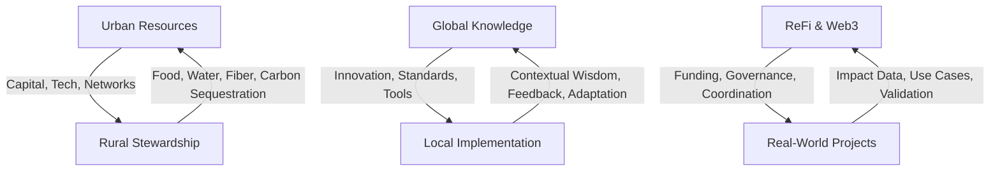

# Bridging Divides: Creating Productive Interfaces

## Introduction: The Ecotone Principle

In ecology, the most productive and biodiverse zones are often found at the boundaries between two distinct ecosystems—these transition areas are called ecotones. The forest edge meeting grassland, or the riparian zone where river meets land, these ecotones support unique species assemblages and dynamic processes.

ReFi Barcelona positions itself as a deliberate ecotone between multiple contexts—creating productive interfaces where distinct social, economic, and ecological systems can interact, exchange, and co-evolve. We focus on three critical divides:

1. **Urban-Rural**: Connecting dense urban centers with their surrounding territories
2. **Global-Local**: Bridging global networks and knowledge with place-based implementation
3. **Digital-Physical**: Linking ReFi & Web3 innovations with real-world regenerative projects

## Hypothesis: Productive Boundaries

Our work is guided by a central hypothesis: **the boundaries between different contexts represent the most promising zones for catalyzing regenerative transformation, as they allow for complementary strengths to be activated in service of whole-system change**.

This hypothesis can be broken down into testable elements:

1. Cross-context collaborations generate more innovation than single-context initiatives
2. Resource flows across boundaries create greater impact than those circulating within isolated contexts
3. Diverse knowledge systems combined with complementary capabilities produce more effective regenerative solutions
4. Systemic divides perpetuate extractive patterns that can only be healed through intentional bridge-building

## The Current Divides: Metabolic Rifts

The divides we address represent what ecological theorists call "metabolic rifts"—fundamental interruptions in the natural cycles that would otherwise connect these contexts:

### Urban-Rural Divide

**Urban Context**
- High concentration of financial capital
- Dense social networks and innovation capabilities
- Technical expertise and technological resources
- Disconnection from ecological processes
- Consumption of resources produced elsewhere

**Rural Context**
- Stewardship of ecological assets
- Traditional knowledge of place-based practices
- Production of essential resources (food, water, fiber)
- Lower population density and market access
- Limited access to financial and technical resources

Recent studies confirm this divide in Catalonia:
- Rural municipalities have 34% less access to digital infrastructure
- Average income in Barcelona is 27% higher than in rural Catalan towns
- 78% of investment capital flows remain within the Barcelona metropolitan area
- Rural areas provide 94% of the region's ecosystem services but receive only 12% of ecosystem service payments

### Global-Local Divide

**Global Context**
- Access to international networks and resources
- Abstracted, scalable knowledge and approaches
- Broad visibility and influence
- Disconnection from local realities and needs
- Risk of imposing universal solutions on diverse contexts

**Local Context**
- Deep contextual understanding
- Place-based knowledge and relationships
- Direct implementation capabilities
- Limited access to external resources and knowledge
- Risk of isolation and reinventing solutions

### Digital-Physical Divide

**ReFi & Web3 Context**
- Access to innovative financial mechanisms
- Distributed governance capabilities
- Global coordination potential
- Technical optimization and efficiency
- Often disconnected from physical implementation

**Real-World Regenerative Projects Context**
- Hands-on ecological knowledge
- Direct relationship with territories
- Tangible impact measurement
- Community trust and engagement
- Often limited by traditional funding mechanisms

## Patterns of Connection: The Bioregional Metabolism

Our approach to bridging these divides involves re-establishing vital metabolic connections between contexts:

This reciprocal pattern enables the creation of what we call a "bioregional metabolism"—a healthy circulation system where diverse components function as interdependent organs within a larger bioregional body.

## Case Studies: Bridges in Action

These divides provide concrete examples of our bridging approach in action:

| Initiative | Context A | Context B | Bridge Mechanism |
|------------|-----------|-----------|------------------|
| Aigua Clara | Barcelona water consumers | Upstream watershed farmers | Direct payment for regenerative agriculture reducing water treatment costs |
| MedReFi Network | Global ReFi protocols | Mediterranean bioregional projects | Multi-lingual knowledge commons and localized implementation guides |
| TokenShift | Web3 developers | Territorial stewards | Open-source digital twin platform linking on-chain governance to physical land management |
| FoodFlow | Urban food cooperatives | Rural small producers | Digital platform + logistics system connecting production to consumption |
| Llobregat Living Lab | Urban university students | Rural community members | Residency program placing technical experts in rural contexts |

These initiatives demonstrate the power of intentional connections that benefit both contexts while regenerating the whole system.

## Methodological Framework: The Bridge-Building Process

Our bridging methodology follows a structured cycle:

### 1. Boundary Mapping (Understanding Patterns)

We begin by identifying the specific aspects of the divide in each context:
- Resource flows (what materials, energy, and information move between contexts)
- Value exchanges (how economic value is created, captured, and distributed)
- Power dynamics (who makes decisions affecting both contexts)
- Knowledge systems (what forms of expertise are recognized and applied)

### 2. Complementarity Analysis (Finding Synergies)

Next, we identify specific complementarities between different contexts:
- What regenerative projects need elements from both contexts to succeed?
- Where can technological capabilities enhance ecological practices?
- How can natural and social capital be fairly valued through innovative financial mechanisms?
- What governance structures can balance voices from different contexts?

### 3. Connection Design (Building Bridges)

Based on this analysis, we design specific mechanisms for connection:

**Physical Connections**
- Transportation and logistics systems for goods and people
- Shared workspace hubs in boundary zones
- Regular events bringing diverse stakeholders together

**Economic Connections**
- Direct market relationships between producers and consumers
- Investment vehicles channeling capital to regeneration
- Shared business models with fair value distribution

**Knowledge Connections**
- Joint research initiatives combining diverse knowledge systems
- Documentation and dissemination of regenerative practices
- Educational exchanges between contexts

**Governance Connections**
- Multi-stakeholder governance structures with balanced representation
- Participatory decision-making processes accessible to all contexts
- Conflict resolution mechanisms that address power imbalances

### 4. Pattern Evolution (Adaptive Learning)

Finally, we maintain an ongoing evaluation and evolution process:
- Regular assessment of bridge effectiveness and impact
- Documentation of emerging patterns and unexpected outcomes
- Adaptation of bridging strategies based on feedback
- Diffusion of successful patterns to other contexts

## Digital + Physical Hybridity: The Bridge Infrastructure

Effective bridges require both digital and physical components:

**Digital Infrastructure**
- Collaborative mapping platforms showing resource flows and project opportunities
- Communication tools adapted to different connectivity contexts
- Economic coordination mechanisms (marketplaces, currencies, funding pools)
- Knowledge commons documenting regenerative practices

**Physical Infrastructure**
- Bioregional mobility network connecting diverse nodes
- Distributed workspace hubs supporting collaboration
- Warehousing and logistics nodes for goods movement
- Regular in-person gatherings and exchanges

## Current Bridge Initiatives

Several concrete bridges are currently under development:

### Rural-Urban Digital Work Program
A partnership with rural municipalities to create technology work opportunities for rural youth, connecting them with Barcelona-based cooperatives while enabling them to remain in their communities. Initial results show:
- 28 rural youth placed in digital jobs
- 94% retention rate after one year
- €840,000 in salary flows to rural communities
- 3 new rural tech cooperative spin-offs

### Global-Local Knowledge Commons
A multi-lingual platform bridging global ReFi innovations with local Mediterranean implementation contexts:
- Translation of key ReFi protocols into Spanish, Catalan, Italian, and Greek
- Adaptation guides for applying global frameworks to Mediterranean bioregions
- Case studies documenting successful local implementations
- Regular knowledge exchange sessions connecting global developers with local practitioners

### Web3-Real World Regeneration Interface
A comprehensive system connecting digital coordination mechanisms with territorial regeneration projects:
- Digital twin platform representing physical landscapes in digital space
- On-chain governance mechanisms tied to physical land stewardship decisions
- Tokenized funding streams supporting real-world ecological outcomes
- Impact verification systems bridging digital claims with physical reality

## Challenges and Tensions

Our bridging work confronts several persistent challenges:

- **Cultural Differences**: Different contexts often maintain distinct worldviews and communication patterns
- **Temporal Mismatches**: Processes operate at different speeds across contexts (e.g., code development vs. ecological restoration)
- **Trust Deficits**: Historical extractive relationships create wariness of new bridging initiatives
- **Infrastructure Limitations**: Physical and digital connectivity constraints in some contexts
- **Value Translation**: Difficulty in equitably valuing different forms of contribution

## Metrics for Successful Bridging

We measure our bridging effectiveness through several indicators:

- **Bi-directional Flow Volume**: Quantitative measure of resources moving in both directions
- **Value Distribution**: Equity in how benefits are shared between stakeholders across contexts
- **Participation Balance**: Relative engagement of participants from different contexts
- **Connection Persistence**: Longevity and resilience of established bridges
- **Ecological Outcomes**: Measurable regenerative impacts resulting from bridging activities

## Strategic Intentions 2024-2026

Our medium-term intentions for bridging work include:

1. Establish a network of 5 bioregional hubs serving as physical connection points between urban and rural contexts
2. Create a comprehensive digital platform mapping resource flows and connection opportunities across all three divides
3. Implement at least 3 significant economic bridges channeling resources to regeneration
4. Document 25+ success stories of cross-context collaboration with measurable outcomes
5. Develop a replicable bridging methodology applicable in other Mediterranean bioregions

## Theoretical Foundations

Our bridging approach draws from several theoretical traditions:

- **Systems Ecology**: Understanding diverse contexts as interdependent components of larger systems
- **Economic Geography**: Analyzing spatial patterns of economic activity and resource flows
- **Commons Theory**: Developing governance for shared resources across boundaries
- **Network Theory**: Mapping and optimizing connection patterns between diverse nodes
- **Transition Design**: Creating intentional interventions at leverage points between systems

## Conclusion: From Division to Symbiosis

The divides we address represent fundamental rifts in our social and ecological systems—divisions that perpetuate extractive relationships and prevent truly regenerative approaches from emerging. By intentionally building bridges across these divides, ReFi Barcelona aims to transform boundaries from zones of extraction to zones of symbiotic exchange.

Our vision is not to erase the distinctive qualities of different contexts, but rather to create connections that allow their complementary strengths to function in harmony—like the distinct but interconnected organs of a healthy organism. Through this bridging work, we contribute to the emergence of a bioregional metabolism that regenerates both human and natural communities.

---

*This article forms part of ReFi Barcelona's bioregional framework. For related perspectives, see our articles on [Why a Bioregional Approach](why-bioregional-approach.md) and [Creating Roots in the Territory](creating-roots-territory.md).* 