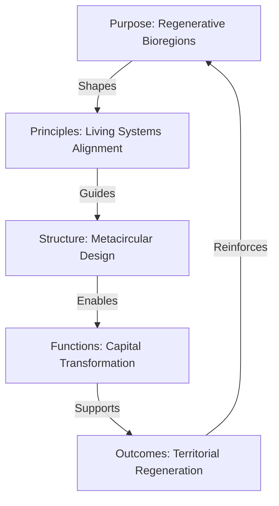
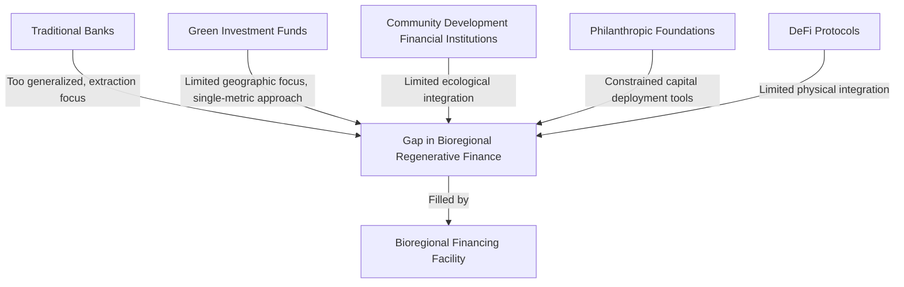

# Building a Bioregional Financing Facility (BFF)

## Introduction: Financial Systems for Living Systems

The financial system serves as the circulatory system of our economy—determining which activities receive resources and which do not. Our current global financial system primarily directs capital toward extractive and degenerative activities, creating the fundamental misalignment that drives ecological collapse and social fragmentation.

ReFi Barcelona's ultimate vision is to evolve into a Bioregional Financing Facility (BFF)—a new type of financial institution designed specifically to serve bioregional regeneration by aligning capital flows with living systems principles. This represents not merely an incremental improvement on existing financial institutions but a fundamental reimagining of what financial infrastructure could be when designed explicitly for regenerative purposes.

## Hypothesis: Bioregional Financial Infrastructure

Our vision for a Bioregional Financing Facility is guided by a central hypothesis: **regenerative outcomes at bioregional scale require dedicated financial infrastructure designed specifically to serve the unique metabolic patterns of living systems rather than extractive paradigms**.

This hypothesis can be broken down into several testable propositions:

1. Purpose-designed financial institutions outperform general-purpose ones in catalyzing regenerative outcomes
2. Bioregionally-focused financing creates more durable ecological health than globalized finance
3. Multi-stakeholder governance of financial resources produces more equitable outcomes than shareholder-centric models
4. Financial systems aligned with living systems principles generate higher regenerative returns than conventional approaches
5. Nested and networked financial facilities create appropriate resource flows at different scales

## The BioFi Framework: Our Guiding Architecture

Our vision of a Bioregional Financing Facility builds directly on the BioFi framework—a comprehensive approach to bioregional finance developed through extensive research and practitioner collaboration. BioFi provides the architectural blueprint for our work, offering both theoretical foundations and practical implementation guidance.

The BioFi framework identifies several key components of effective bioregional finance:

This framework emphasizes the circular relationship between purpose, principles, structure, functions, and outcomes—creating a coherent and self-reinforcing approach to bioregional finance.

## From ReFi BCN to BFF: The Evolutionary Path

Our development into a full Bioregional Financing Facility follows a deliberate evolutionary path consisting of several distinct phases:

### Phase 1: Foundation Building (2023-2024)

During this initial phase, which we're currently in, we focus on:
- Establishing the cooperative legal entity with appropriate governance
- Building key relationships across the bioregion
- Developing and testing prototype funding mechanisms
- Creating essential technical infrastructure
- Building knowledge and capacity in the core team

**Key Milestones**:
- Legal incorporation as a multi-stakeholder cooperative
- Pilot funding rounds demonstrating our approach
- Initial mapping of regenerative initiatives across Catalonia
- Participation in ReFi Mediterranean network
- Development of impact assessment methodology

### Phase 2: Capability Expansion (2025-2026)

In the second phase, we develop more sophisticated capabilities:
- Expanding network relationships to cover the full bioregion
- Implementing comprehensive multi-capital accounting
- Creating specialized financial instruments for regeneration
- Building capacity in impact verification and assessment
- Developing formal bioregional governance participation

**Key Milestones**:
- Management of at least €1M in regenerative funding annually
- Formal relationships with 50+ bioregional regenerative initiatives
- Implementation of comprehensive digital infrastructure
- Development of at least 3 bioregionally-focused investment vehicles
- Creation of a bioregional regenerative asset library

### Phase 3: System Integration (2027-2028)

In the third phase, we integrate our capabilities into a coherent system:
- Formalizing our role in bioregional governance and planning
- Establishing connection points with traditional financial institutions
- Developing comprehensive regenerative portfolio management
- Creating specialized training and capacity building programs
- Building inter-bioregional exchange mechanisms

**Key Milestones**:
- Formal recognition as a key bioregional financial institution
- Integration with regional planning and development processes
- Management of multiple specialized regenerative funds
- Operation of a comprehensive impact measurement system
- Regular bioregional state of regeneration reporting

### Phase 4: Full BFF Implementation (2029+)

In the final phase, we achieve full functionality as a Bioregional Financing Facility:
- Serving as the primary financial infrastructure for bioregional regeneration
- Managing comprehensive suite of regenerative financial instruments
- Providing complete regenerative capital stack from grants to investment
- Operating at full bioregional scale with appropriate local nodes
- Participating in global network of Bioregional Financing Facilities

**Key Milestones**:
- Management of at least €10M in regenerative capital annually
- Full-spectrum financial services supporting regenerative economy
- Comprehensive bioregional impact assessment and reporting
- Recognized model for other emerging Bioregional Financing Facilities
- Active participation in global bioregional finance networks

## Core BFF Functions: The Regenerative Capital Stack

As a fully realized Bioregional Financing Facility, ReFi BCN will perform several essential functions that together create a complete "regenerative capital stack" serving different aspects of bioregional regeneration:

### 1. Commons Stewardship

Functions related to managing shared bioregional assets:
- Holding rights to key bioregional commons (watersheds, forests, knowledge)
- Administering participatory governance for shared resources
- Developing and applying appropriate stewardship protocols
- Measuring and monitoring commons health and productivity

### 2. Catalytic Capital Deployment

Functions focused on early-stage or higher-risk regenerative activities:
- Grant programs for regenerative research and development
- Blended finance instruments combining grant and investment elements
- Accelerator and incubator programs for regenerative enterprises
- Challenge prizes for key bioregional regenerative innovations

### 3. Regenerative Enterprise Financing

Functions supporting established regenerative businesses:
- Patient capital investment in regenerative enterprises
- Revenue-based financing aligned with ecological timeframes
- Working capital facilities for seasonal regenerative businesses
- Growth capital for scaling proven regenerative models

### 4. Infrastructure & Facilities Development

Functions creating long-term regenerative physical assets:
- Bond instruments for regenerative infrastructure projects
- Long-term asset-backed financing for key facilities
- Shared ownership models for critical infrastructure
- Community land trusts and similar long-term stewardship vehicles

### 5. Risk Management & Resilience

Functions addressing uncertainty and building adaptability:
- Community-based insurance mechanisms for regenerative assets
- Climate resilience bonds and catastrophe protection
- Endowment structures for long-term financing needs
- Emergency response funds for bioregional crises

### 6. Value Exchange & Circulation

Functions facilitating resource flows within the bioregion:
- Local and complementary currency systems
- Mutual credit networks for business-to-business exchange
- Time banking and other non-monetary exchange systems
- Reputation systems for tracking non-financial contributions

### 7. Impact Measurement & Valuation

Functions assessing and valuing regenerative outcomes:
- Comprehensive impact assessment frameworks
- Multi-capital accounting systems
- Verification and certification protocols
- Regenerative asset valuation methodologies

## Distinctive Organizational Design: The Metacircular Institution

The organizational design of our Bioregional Financing Facility follows what we call a "metacircular" approach—deliberately embodying the same patterns we seek to create in the bioregion. This represents a fundamental departure from conventional financial institutions.

### Multi-layered Governance

Our governance structure features multiple interconnected layers:

**Stakeholder Layer**
- Cooperative membership across different stakeholder classes
- Democratic decision-making on fundamental direction and purpose
- Regular general assemblies and referendum mechanisms
- Clear delegation protocols to operational bodies

**Operational Layer**
- Sociocratic circles organized around key functions and bioregional territories
- Dynamic governance with distributed authority
- Clear roles, responsibilities, and accountability
- Continuous improvement processes

**Expert Layer**
- Advisory councils with specialized expertise
- Peer review processes for technical decisions
- Research partnerships with academic institutions
- Practice communities developing specific methodologies

**Network Layer**
- Formal participation in bioregional governance networks
- Connections with other BFFs and regenerative finance institutions
- Representation in relevant policymaking forums
- Engagement with civil society organizations

This multi-layered approach ensures decisions are made at appropriate levels while maintaining coherence with our regenerative purpose.

### Integrated Digital-Physical Infrastructure

Our BFF combines digital and physical infrastructure to serve the entire bioregion:

**Digital Components**:
- Comprehensive digital platform for member engagement
- Impact dashboard showing real-time regenerative indicators
- Multi-capital accounting system tracking diverse value forms
- Open API enabling ecosystem of complementary applications

**Physical Components**:
- Network of local nodes in different bioregional territories
- Shared workspaces for regenerative practitioners
- Community financial centers providing direct services
- Mobile units reaching less connected areas

This integrated approach ensures accessibility across the digital divide while leveraging technology for efficiency and transparency.

## Case Study: Catalonia Water Resilience Facility

To illustrate how our BFF would function in practice, we can examine a hypothetical but realistic initiative we aim to develop: the Catalonia Water Resilience Facility.

This specialized financing mechanism would address one of the most critical challenges facing the Mediterranean region—water scarcity and watershed degradation—through a comprehensive approach:

**Purpose**:
To finance the regeneration of Catalonia's watershed systems while ensuring equitable water access and resilience to climate change

**Structure**:
- Special-purpose fund within the broader BFF
- Multi-stakeholder governance including water authorities, farmers, conservation organizations, and urban users
- Technical committee providing scientific guidance
- Implementation partners across the watershed

**Financial Instruments**:
- **Watershed Bonds**: Long-term debt instruments financing major restoration projects
- **Water Stewardship Agreements**: Payments to upstream land managers for watershed services
- **Efficiency Credit Facility**: Financing for water-saving technologies with repayment through savings
- **Climate Adaptation Grants**: Direct support for climate-resilient water infrastructure
- **Water Commons Tokens**: Digital assets representing rights and responsibilities in watershed governance

**Impact Metrics**:
- Water quality indicators across watershed
- Aquifer recharge rates
- Biodiversity indicators for riparian zones
- Community water access measures
- Climate resilience metrics

**Implementation Pathway**:
1. Watershed mapping and opportunity assessment
2. Stakeholder engagement and governance design
3. Initial pilot projects in highest-priority zones
4. Financial instrument development and testing
5. Scaling to full watershed coverage
6. Integration with broader water governance

This example demonstrates how our BFF would develop specialized financing mechanisms addressing specific bioregional regeneration needs while maintaining coherent principles and approaches.

## Positioning in the Financial Ecosystem

Our Bioregional Financing Facility occupies a distinctive niche in the broader financial ecosystem:

This positioning allows us to:
- Collaborate with traditional institutions where appropriate
- Address gaps in current financing landscapes
- Provide specialized services not available elsewhere
- Demonstrate viable alternatives to extractive finance
- Influence the broader financial system through successful examples

## Technical Infrastructure Requirements

Building a Bioregional Financing Facility requires sophisticated technical infrastructure combining traditional financial capabilities with regenerative-specific functions:

**Core Financial Systems**:
- Multi-currency treasury management
- Payment processing in diverse currencies
- Financial reporting and compliance
- Risk management and assessment
- Portfolio management tools

**Regenerative Components**:
- Multi-capital accounting and valuation
- Impact measurement and verification
- Regenerative asset registry
- Natural capital assessment tools
- Bioregional mapping and visualization

**Governance Systems**:
- Multi-stakeholder decision platforms
- Transparent allocation mechanisms
- Participatory proposal systems
- On-chain governance integration
- Delegation and representation tools

**Knowledge Systems**:
- Bioregional practices library
- Project documentation repository
- Open data sharing protocols
- Learning management system
- Research collaboration tools

This integrated infrastructure enables the full functionality of a BFF while maintaining transparency, participation, and alignment with regenerative principles.

## Challenges and Tensions

We recognize several significant challenges in developing a Bioregional Financing Facility:

- **Regulatory Complexity**: Financial institutions face extensive regulation not designed for bioregional or regenerative purposes
- **Capacity Requirements**: Operating sophisticated financial services requires specialized expertise and systems
- **Capital Requirements**: Significant initial capital is needed to establish credibility and operations
- **Cultural Transformation**: Moving beyond extractive financial paradigms requires deep cultural change
- **Timeframe Mismatches**: Ecological regeneration occurs on longer timeframes than conventional finance

We address these challenges through:
- Progressive development of capabilities aligned with regulatory requirements
- Partnerships with existing institutions providing complementary expertise
- Creative capital formation combining diverse sources and structures
- Explicit cultural development and educational components
- Patient capital approaches and appropriate expectations setting

## Metrics for BFF Development

We track our progress toward becoming a full Bioregional Financing Facility through several key metrics:

- **Capital Under Management**: Total resources deployed through our various instruments
- **Bioregional Coverage**: Geographic and sectoral breadth of our financing activities
- **Instrument Diversity**: Range of financial tools available for different regenerative needs
- **Stakeholder Participation**: Breadth and depth of engagement in governance
- **Regenerative Impact**: Measured outcomes across multiple capitals
- **Organizational Capability**: Internal capacity to perform key BFF functions
- **System Influence**: Adoption of our approaches by other financial actors

## Strategic Intentions 2024-2030

Our long-term strategic intentions for BFF development include:

1. Establish ReFi BCN as the primary regenerative financial institution for the Catalan bioregion
2. Develop a complete suite of financing tools covering the entire regenerative capital stack
3. Create a comprehensive impact measurement system specific to Mediterranean regeneration
4. Build capacity to manage at least €50M in regenerative capital by 2030
5. Serve as a model and knowledge resource for other emerging Bioregional Financing Facilities
6. Participate actively in transforming the broader financial system toward regenerative paradigms

## Theoretical Foundations

Our approach to developing a Bioregional Financing Facility draws from several theoretical traditions:

- **Ecological Economics** (Herman Daly, Joshua Farley): Economy as subsystem of biosphere
- **Regenerative Economics** (John Fullerton): Eight principles of regenerative economics
- **Living Systems Theory** (Fritjof Capra): Applying natural patterns to human systems
- **Bioregionalism** (Peter Berg, Raymond Dasmann): Organizing human activity along ecological boundaries
- **Commons Theory** (Elinor Ostrom): Governance systems for shared resources

These foundations are complemented by emerging frameworks from:
- **Tokenomics**: Designing incentive systems using digital tokens
- **DeFi**: Creating programmable and transparent financial protocols
- **ReFi**: Aligning cryptocurrency mechanisms with regenerative outcomes
- **BioFi**: Specific framework for bioregional financial facilities

## Conclusion: Financial Systems for a Regenerative Future

The transition to a regenerative civilization requires fundamentally reimagining our financial institutions. Rather than continuing to adapt extractive financial models through incremental ESG improvements, we need purpose-built financial infrastructure designed explicitly to serve regenerative outcomes.

The Bioregional Financing Facility represents our vision for such purpose-built financial infrastructure—rooted in place, aligned with living systems principles, and designed to serve the unique needs of bioregional regeneration. By developing ReFi Barcelona into a fully functional BFF, we aim to create not just a new institution but a replicable model that could be adapted for bioregions worldwide.

This work connects us to the growing global movement to create financial systems that serve life rather than extract from it. As part of the emerging network of bioregional regenerative finance initiatives, we contribute to a fundamental transformation of how resources flow through human and natural systems—from patterns of extraction and concentration to patterns of regeneration and circulation.

The path from our current state to a fully realized Bioregional Financing Facility involves substantial challenges and will require persistent effort over many years. Yet we believe this transformation of financial infrastructure is essential to achieving regenerative outcomes at bioregional scale. By establishing the connective tissue between regenerative vision and practical reality, a Bioregional Financing Facility serves as a critical catalyst for the transition to a thriving regional system that creates health and abundance for all life.

---

*This article forms part of ReFi Barcelona's bioregional framework. For related perspectives, see our articles on [Flow Funding and Resource Allocation](flow-funding-resource-allocation.md) and [The Cooperative Structure as an Enabler](cooperative-structure-enabler.md).* 