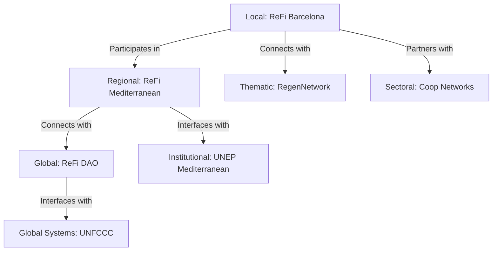

# Collaborating in Wider Bioregions and Networks

## Introduction: Nested Systems Thinking

While ReFi Barcelona's primary focus is the Catalan bioregion, we recognize that bioregions themselves exist as nested systems within larger ecological, cultural, and economic patterns. The Mediterranean basin represents a metacircular system that connects our local bioregion to a broader network of similar contexts facing shared challenges and opportunities.

This article explores our approach to collaborating across wider bioregional networks, with a particular focus on our active participation in the emerging ReFi Mediterranean network—a constellation of regenerative finance initiatives spanning the Mediterranean basin.

## Hypothesis: Bioregionally Networked Impact

Our approach to wider bioregional collaboration is guided by a central hypothesis: **regenerative efforts achieve greater systemic impact when local bioregional initiatives connect through coherent networks that mirror larger ecological patterns**.

This hypothesis can be broken down into several testable propositions:

1. Knowledge transfer between similar bioregional contexts accelerates regenerative impact
2. Resource pooling across bioregions creates greater leverage than isolated funding
3. Policy innovation diffuses more effectively through bioregional networks than through traditional channels
4. Shared ecological challenges (climate, water, biodiversity) require coordination at appropriate scales
5. Regenerative markets function more effectively when connected across complementary bioregions

## The Mediterranean Context: Shared Challenges, Diverse Responses

The Mediterranean basin represents one of the world's most significant biogeographical regions:

- 46,000 km of coastline across three continents
- 22 countries with 480+ million inhabitants
- 5,000+ years of continuous human civilizational development
- One of the world's 25 biodiversity hotspots with 25,000+ plant species
- Shared climate patterns and interconnected marine ecosystems
- Similar agricultural traditions and food systems

Yet this shared context faces accelerating common challenges:

- Climate change impacts 50% more severe than global averages
- Water scarcity affecting 180+ million people
- Coastal development pressure from 350+ million annual tourists
- Marine ecosystem degradation from pollution and overfishing
- Agricultural land degradation and desertification risk
- Urban concentration and rural abandonment

These shared challenges create a natural basis for bioregional collaboration, as solutions developed in one Mediterranean context often apply to others with similar ecological and cultural patterns.

## The ReFi Mediterranean Network: A Living Constellation

In response to these shared challenges, ReFi Barcelona has helped catalyze the formation of ReFi Mediterranean—a network of bioregional regenerative finance initiatives across the Mediterranean basin.

Current active nodes in this network include:

| Node | Location | Primary Focus | Complementary Strength |
|------|----------|---------------|------------------------|
| ReFi Barcelona | Catalonia, Spain | Cooperative governance, technical infrastructure | Urban-rural bridging, DAO systems |
| ReFi Sicilia | Sicily, Italy | Rural regeneration, agroforestry | Traditional knowledge, land restoration |
| ReFi Lisboa | Portugal | Marine regeneration, blue economy | Ocean stewardship, coastal communities |
| ReFi PACA | Provence-Alpes-Côte d'Azur, France | Alpine-Mediterranean transition, water systems | Watershed management, tourism transition |
| Earthist | Türkiye | Earthquake regeneration, community resilience | Disaster recovery, rapid mobilization |

This network operates as a "constellation" rather than a hierarchical structure—each node maintains its autonomy while participating in shared initiatives, knowledge exchange, and resource flows.

## Patterns of Collaboration: Networked Symbiosis

Our approach to bioregional collaboration follows several distinct but interconnected patterns:

### 1. Knowledge Commoning

The most fundamental form of collaboration is the shared documentation and exchange of bioregionally-appropriate regenerative practices:

- **Mediterranean Regenerative Practices Database**: A multi-lingual repository of place-based regenerative methodologies with attribution and adaptation protocols
- **Cross-Bioregional Learning Exchanges**: Regular visits and residencies between bioregional nodes
- **Practice Translation**: Processes for adapting successful approaches from one context to another while respecting cultural and ecological differences
- **Mediterranean Regeneration Research Network**: Collaborative research initiatives connecting academic and practical knowledge

This knowledge commons creates a shared intelligence that accelerates regenerative impact across the network, avoiding redundant experimentation while enabling contextual adaptation.

### 2. Resource Pooling

Beyond knowledge, we collaborate through various resource pooling mechanisms:

- **Mediterranean Impact Quadratic Funding**: Shared funding pools distributed through preference aggregation and matching
- **Inter-Bioregional Investment Circles**: Collaborative investment in projects with cross-bioregional benefits
- **Reciprocal Resource Protocols**: Formal agreements for sharing specialized equipment, materials, or expertise
- **Joint Grant Applications**: Combined proposals to access larger-scale funding sources

These pooling mechanisms address the capital constraints that often limit bioregional regeneration, creating economies of scale while maintaining local relevance.

### 3. Market Network Development

The network is developing connected regenerative market mechanisms:

- **Mediterranean Regenerative Product Certification**: Shared standards and verification systems
- **Inter-Bioregional Exchange Platforms**: Digital and physical infrastructure for regenerative product exchange
- **Complementary Currency Protocols**: Interoperable local currencies that support regenerative trade flows
- **Tourism Exchange Programs**: Channeling visitors between bioregional nodes through regenerative experiences

These market connections help scale regenerative business models beyond local constraints while maintaining bioregional integrity.

### 4. Governance Collaboration

At the governance level, we collaborate through:

- **Mediterranean ReFi Council**: Representatives from each node coordinating network activities
- **Shared Policy Framework**: Collaborative development of policy recommendations for different jurisdictional levels
- **Cross-Border Commons Management**: Governance models for shared resources like watersheds and marine areas
- **Joint Representation**: Unified engagement with larger international networks and institutions

This governance collaboration allows the network to engage with larger systems while maintaining bioregional autonomy.

## Case Study: The Mediterranean GG23 Round

A concrete example of our wider bioregional collaboration is the Mediterranean GG23 (Gitcoin Grants) round—the first bioregionally-focused ReFi funding mechanism in the Mediterranean.

This initiative demonstrates the power of networked collaboration:

**Preparation Phase**:
- Each bioregional node identified high-impact local projects
- Joint criteria were developed based on Mediterranean-specific regenerative needs
- Technical infrastructure was adapted to accommodate multiple languages and currencies
- Communication strategy leveraged all nodes' networks

**Execution Phase**:
- €120,000 in matching funds secured through combined network relationships
- 47 projects across 5 Mediterranean countries participated
- 1,200+ individual contributions from 30+ countries
- Innovative hybrid allocation mechanism combining Impact QF (50%) and COCM QF (50%)

**Results**:
- 40% of projects received first-time regenerative funding
- Cross-pollination of community support between bioregions
- Detailed impact data collected across standardized metrics
- Strong media coverage across Mediterranean region

**Knowledge Capture**:
- Comprehensive documentation of process and outcomes
- Identification of improvement opportunities
- Template created for other bioregional networks
- Academic paper analyzing results in preparation

This prototype demonstrates how bioregional networks can mobilize resources more effectively than isolated initiatives while maintaining local relevance and impact.

## The Network-of-Networks Approach

Beyond the Mediterranean network, ReFi Barcelona participates in a broader "network of networks" approach that connects bioregional efforts across different scales:

This nested network approach allows us to maintain primary focus on our bioregion while effectively engaging with broader systems that influence regenerative outcomes. It exemplifies our understanding of regeneration as a multi-scale process requiring appropriate interventions at each level.

## Digital Infrastructure for Bioregional Collaboration

Our wider bioregional collaboration is enabled by purpose-built digital infrastructure:

- **Hylo Mediterranean Communities**: Coordination platform for inter-bioregional projects
- **Mediterranean Regenerative Map**: Geospatial platform showing initiatives, resources, and impact
- **Inter-Bioregional DAO**: Governance and treasury management for shared resources
- **Federated Knowledge Commons**: Distributed documentation system for regenerative practices

This digital layer complements physical collaboration through:

- **Bioregional Hubs Network**: Physical spaces hosting visitors from other bioregions
- **Mediterranean Convergences**: Regular in-person gatherings rotating between regions
- **Practitioner Exchange Program**: Residencies and visits building personal relationships
- **Material Resource Sharing**: Systems for sharing specialized equipment and materials

## Challenges and Tensions in Wider Collaboration

We recognize several challenges in our wider bioregional collaboration:

- **Language and Cultural Barriers**: Mediterranean diversity creates communication challenges
- **Jurisdictional Complexity**: Different regulatory frameworks complicate joint initiatives
- **Resource Disparities**: Significant economic differences between Mediterranean regions
- **Political Tensions**: Historical and ongoing conflicts affect certain collaborations
- **Logistical Constraints**: Physical distance and transportation challenges

We address these challenges through:
- Multi-lingual communication protocols and translation resources
- Legal expertise network navigating different jurisdictional requirements
- Solidarity-based resource sharing prioritizing higher-need contexts
- Focus on ecological commons transcending political divisions
- Investment in low-carbon mobility and digital collaboration tools

## Metrics for Effective Network Collaboration

We measure the effectiveness of our wider bioregional collaboration through several indicators:

- **Knowledge Transfer Metrics**: Documentation, adaptation, and implementation of practices across bioregions
- **Resource Flow Metrics**: Volume and distribution of financial and other resources mobilized through the network
- **Collaboration Density**: Number and quality of active collaborations between nodes
- **Impact Synergy**: Measurable benefits from collaborative versus isolated approaches
- **Network Resilience**: Response effectiveness to shared challenges or opportunities

## Strategic Intentions 2024-2026

Our medium-term intentions for wider bioregional collaboration include:

1. Expand the ReFi Mediterranean network to include at least 4 additional bioregional nodes
2. Establish a formal Mediterranean Regenerative Knowledge Commons with 200+ documented practices
3. Execute three Mediterranean-wide collaborative funding rounds distributing at least €1M to regenerative projects
4. Develop a standardized methodology for Mediterranean bioregional resilience assessment
5. Create a Mediterranean policy framework with recommendations for different jurisdictional levels

## Theoretical Foundations

Our approach to wider bioregional collaboration draws from several theoretical traditions:

- **Bioregionalism** (Peter Berg, Raymond Dasmann): Understanding ecological regions as appropriate organizing units
- **Network Theory** (Albert-László Barabási): Analyzing how network structures influence system behavior
- **Commons Governance** (Elinor Ostrom): Developing multi-level governance for shared resources
- **Complexity Theory** (Stuart Kauffman): Understanding emergent behavior in complex adaptive systems
- **Mediterranean Studies** (Fernand Braudel): Recognizing historical patterns of exchange and connection

These foundations are complemented by emerging frameworks from:
- **DeFi and ReFi**: Creating mechanisms for value exchange across boundaries
- **DAO Governance**: Enabling coordination without centralized control
- **Token Engineering**: Designing incentive systems for regenerative activities

## Conclusion: Bioregional Collaboration as Evolutionary Strategy

Our commitment to wider bioregional collaboration represents a strategic recognition that regeneration must occur at multiple scales simultaneously. Just as healthy ecosystems feature both local adaptation and broader patterns of connection, regenerative human systems require both deep bioregional rootedness and wider collaborative networks.

The ReFi Mediterranean network exemplifies this nested approach—creating connections that honor bioregional uniqueness while enabling shared learning, resource mobilization, and coordinated action at appropriate scales. Through this living constellation of bioregional initiatives, we're developing patterns of collaboration that might serve as templates for regenerative organization worldwide.

As climate change and other planetary challenges intensify, these bioregional networks may prove to be essential evolutionary structures—capable of maintaining local resilience while coordinating broader systemic responses. By actively participating in and helping to shape these emergent networks, ReFi Barcelona contributes to both immediate regenerative impact and longer-term systemic transformation.

---

*This article forms part of ReFi Barcelona's bioregional framework. For related perspectives, see our articles on [Why a Bioregional Approach](why-bioregional-approach.md) and [Flow Funding and Resource Allocation](flow-funding-resource-allocation.md).* 