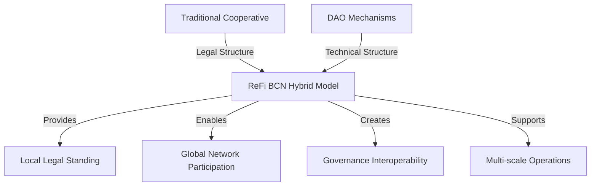

# The Cooperative Structure as an Enabler

## Introduction: Organizational Mycelium

In the development of ReFi Barcelona's bioregional approach, the choice of legal and organizational structure is not merely a technical detail but a fundamental strategic decision. We've chosen a multi-stakeholder cooperative model that functions as our "organizational mycelium"—a living structure that provides both stability and adaptability, connecting diverse participants while maintaining alignment with our regenerative purpose.

This article explores how our cooperative structure enables the bioregional approach by creating unique capabilities that neither traditional organizations nor fully decentralized autonomous organizations (DAOs) could achieve alone.

## Hypothesis: Structural-Functional Alignment

Our core hypothesis states that **organizational structures most effectively catalyze regenerative change when they embody the same patterns they seek to create in the world**. In other words, we can't create collaborative, equitable, regenerative systems through extractive, hierarchical, or fragmented organizations.

This hypothesis leads us to test several propositions:

1. Multi-stakeholder cooperative governance better balances urban-rural needs than centralized or purely market-based models
2. Legal cooperative structures provide essential legitimacy and operational capacity while remaining values-aligned
3. Hybrid cooperative-DAO models enable both local rootedness and global network participation
4. Cooperative principles (especially concern for community) naturally align with bioregional regenerative purposes

## Catalonia's Cooperative Ecosystem: Building on Legacy

Our cooperative approach doesn't emerge in isolation, but builds upon Catalonia's rich cooperative history:

- 4,300+ cooperatives operating in the region
- The world's first cooperative legislation passed in 1915
- Internationally recognized innovations in social, housing, and worker cooperatives
- Extensive support infrastructure through the Xarxa d'Economia Solidària

This legacy provides ReFi BCN with several advantages:
- Established legal frameworks and precedents
- Cultural familiarity and acceptance
- Existing networks for intercooperation
- Policy support at municipal and regional levels

## The Multi-Stakeholder Model: Weaving the Ecosystem

ReFi BCN's cooperative structure employs a multi-stakeholder model that deliberately integrates diverse participants in the bioregional regenerative ecosystem:

| Stakeholder Class | Representation | Governance Rights | Examples |
|-------------------|---------------|------------------|----------|
| Worker Members | Those directly employed by the cooperative | Full participation in governance and operations | Technical team, administrators, coordinators |
| Project Members | Regenerative initiatives within the bioregion | Participation in resource allocation and strategic direction | Agroecological farms, restoration projects, forest stewards |
| Community Members | Organizations and individuals supporting the mission | Participation in general assembly and advisory councils | Funders, volunteers, knowledge contributors |
| Collaborating Entities | Allied organizations with formal relationships | Representation on inter-organizational bodies | Other cooperatives, public institutions, funding partners |

This multi-stakeholder design enables what we call "polycentric governance"—decision-making distributed across multiple centers connected through a coherent framework. This pattern mirrors the distributed intelligence found in natural systems, where different functions are managed at appropriate levels while maintaining whole-system coherence.

## Cooperative Principles as Regenerative Foundations

The seven internationally recognized cooperative principles provide a strong foundation for bioregional regeneration:

1. **Voluntary and Open Membership** → Enables inclusive participation across the bioregion
2. **Democratic Member Control** → Ensures balanced voice between urban and rural stakeholders
3. **Member Economic Participation** → Creates shared ownership of regenerative resources
4. **Autonomy and Independence** → Prevents capture by extractive or centralized interests
5. **Education, Training, and Information** → Supports capacity building and knowledge commons
6. **Cooperation among Cooperatives** → Facilitates inter-bioregional collaboration
7. **Concern for Community** → Explicitly embeds care for social and ecological systems

These principles align naturally with regenerative values while providing a proven governance framework that has evolved over 175+ years of cooperative development.

## The Cooperative Advantage in Bioregional Contexts

Our cooperative structure provides several specific advantages for bioregional approach:

### 1. Legal Personhood and Agency

As a formally constituted cooperative, ReFi BCN can:
- Enter into contracts with public and private entities
- Hold assets on behalf of the bioregional commons
- Apply for grants and institutional funding
- Employ staff and manage operations
- Interact with regulatory frameworks

This legal agency is essential for bridging between traditional systems and emerging regenerative models—allowing us to function effectively within existing legal and economic structures while working to transform them.

### 2. Democratic Bioregional Governance

The cooperative model provides a tested framework for democratic governance across geographic and sectoral boundaries:
- One member, one vote principle ensures rural voices equal urban ones
- Sociocratic circles can be organized around bioregional territories or functions
- Representative structures balance efficiency with participation
- Clear processes for conflict resolution and decision-making

### 3. Capital Stewardship

Cooperatives excel at managing capital for community benefit rather than extraction:
- Asset locks prevent privatization of community resources
- Limited return on investment ensures primacy of purpose over profit
- Indivisible reserves build long-term regenerative capacity
- Surplus distribution mechanisms prioritize ecological reinvestment

### 4. Multi-capital Accounting

Our cooperative structure enables accounting for multiple forms of capital relevant to bioregional regeneration:
- Financial capital: Traditional accounting for monetary resources
- Natural capital: Tracking ecological assets and impacts
- Social capital: Measuring relationship strength and trust
- Knowledge capital: Accounting for intellectual and cultural resources
- Material capital: Managing physical infrastructure

This multi-capital approach allows us to make decisions based on integrated impact rather than narrowly financial metrics.

## Bridging Traditional Cooperatives and Web3 Innovation

Where our approach extends beyond traditional cooperativism is in our deliberate integration with web3 and DAO (Decentralized Autonomous Organization) technologies and practices. This creates a hybrid model with unique capabilities:

Specific innovations in our hybrid approach include:

### 1. Cooperative-Wrapped DAO

Our structure incorporates a "cooperative-wrapped DAO" model where:
- The legal cooperative provides compliance, contracts, and local operations
- DAO mechanisms provide transparent governance and global participation
- Smart contracts encode cooperative principles into digital operations
- Token-based systems complement but don't replace cooperative membership

This structure solves key challenges facing both traditional cooperatives (limited geographic scale, capital constraints) and DAOs (legal uncertainty, difficulty with physical operations).

### 2. Hybrid Governance Stack

Our governance integrates cooperative and web3 mechanisms in a coherent stack:

| Layer | Governance Mechanism | Primary Function |
|-------|---------------------|------------------|
| 1 | Legal Cooperative Assembly | Ultimate authority, compliance, legal representation |
| 2 | Sociocratic Circles | Operational management, domain-specific decision-making |
| 3 | DAO Voting | Resource allocation, transparent decision tracking |
| 4 | Quadratic Systems | Preference aggregation, impact assessment |
| 5 | Prediction Markets | Collective intelligence, forecasting |

This layered approach allows different types of decisions to use appropriate mechanisms—from high-legitimacy formal voting to rapid operational decisions to nuanced preference aggregation.

### 3. Programmable Capital Flows

By combining cooperative treasury management with web3 financial tools, we enable:
- Automated flow funding to regenerative projects based on impact metrics
- Conditional funding with milestone verification
- Bioregional currencies and mutual credit systems
- Transparent tracking of resource allocation

These systems make capital more responsive to regenerative needs while maintaining accountability to cooperative members and principles.

## Case Study: Mediterranean ReFi Collaborative Funding

A concrete example of our hybrid model in action is the Mediterranean ReFi Collaborative Funding initiative, which demonstrates how our cooperative structure enables unique capabilities:

**Traditional Cooperative Elements**:
- Legal contracting with funders and receivers
- Fiscal sponsorship for informal groups
- Compliance with regulatory requirements
- Local currency banking relationships

**Web3 Elements**:
- Impact Quadratic Funding for preference aggregation
- COCM QF for community-owned Matching calculation
- Transparent on-chain fund distribution tracking
- Cross-border collaboration without intermediaries

This initiative has successfully deployed over €250,000 to regenerative projects across five Mediterranean countries, demonstrating how our hybrid structure can operate effectively across traditional jurisdictional boundaries while maintaining compliance and legitimacy.

## Evolutionary Path: From Cooperative to Bioregional Financing Facility

Our cooperative structure is not a static model but an evolutionary platform that enables progressive development toward our vision of a Bioregional Financing Facility. This evolution follows a deliberate path:

**Phase 1: Foundational Cooperative (Current)**
- Establishing legal entity and membership
- Developing hybrid governance systems
- Building initial network relationships
- Testing funding and resource allocation mechanisms

**Phase 2: Aggregative Cooperative (2024-2025)**
- Expanding membership across bioregional sectors
- Implementing multi-capital accounting systems
- Developing bioregional investment vehicles
- Creating intercooperative agreements with key partners

**Phase 3: Bioregional Financing Facility (2026+)**
- Establishing formal role in bioregional resource governance
- Managing significant regenerative investment portfolios
- Operating comprehensive impact assessment systems
- Implementing full-spectrum bioregional financing tools

This phased evolution allows us to build capabilities and trust progressively while maintaining alignment with our core cooperative principles and regenerative purpose.

## Challenges and Tensions

We recognize several challenges in our cooperative approach:

- **Speed vs. Participation**: Democratic processes take time, while ecological crises demand rapid action
- **Legal Complexity**: Hybrid cooperative-DAO models face uncertain regulatory landscapes
- **Technical Accessibility**: Web3 tools can create barriers for some potential participants
- **Resource Requirements**: Building robust governance requires significant up-front investment
- **Cultural Integration**: Cooperative and web3 communities have different norms and expectations

We address these tensions through:
- Clear delegation systems that balance democratic control with operational efficiency
- Conservative legal approach that prioritizes compliance while exploring innovation
- Investment in user experience and training to make technical systems accessible
- Recognition that governance is itself a regenerative investment, not overhead
- Dedicated cultural bridging efforts between cooperative and tech communities

## Metrics for Cooperative Effectiveness

We measure the effectiveness of our cooperative structure through several indicators:

- **Governance Participation**: Percentage of members actively engaged in decision-making
- **Stakeholder Diversity**: Distribution of membership across urban/rural and sectoral categories
- **Decision Quality**: Alignment of resource allocation with regenerative priorities
- **Member Retention**: Longevity of cooperative relationships
- **Intercooperative Relationships**: Number and depth of collaborations with other cooperatives
- **Governance Efficiency**: Time and resources required for decision processes

## Strategic Intentions 2024-2026

Our medium-term intentions for cooperative development include:

1. Expand membership to include at least 30 regenerative projects across the Catalan bioregion
2. Implement a comprehensive multi-capital accounting system integrated with cooperative governance
3. Establish formal intercooperative agreements with key networks including XES, Resilience.Earth, and The Commons Network
4. Develop and document a replicable model for "cooperative-wrapped DAO" structures applicable in other bioregions
5. Create a dedicated educational program on cooperative governance for regenerative purposes

## Conclusion: Cooperative Structure as Living System

Our cooperative approach represents more than just a legal or governance choice—it embodies our understanding of organizations as living systems that must exemplify the regenerative patterns we seek to create in the world. By blending the proven democratic principles of cooperativism with the innovative capabilities of web3 technologies, we've created an organizational mycelium capable of connecting diverse stakeholders across the bioregion while maintaining coherence with our regenerative purpose.

This hybrid cooperative structure provides the essential enabling conditions for our bioregional approach—legal legitimacy, democratic governance, capital stewardship, and cross-boundary collaboration—while remaining adaptable to emerging needs and opportunities. As we evolve toward becoming a true Bioregional Financing Facility, this cooperative foundation will continue to serve as the living organizational substrate through which bioregional regeneration can flourish.

---

*This article forms part of ReFi Barcelona's bioregional framework. For related perspectives, see our articles on [Why a Bioregional Approach](why-bioregional-approach.md) and [Building a Bioregional Financing Facility](building-bioregional-financing-facility.md).* 