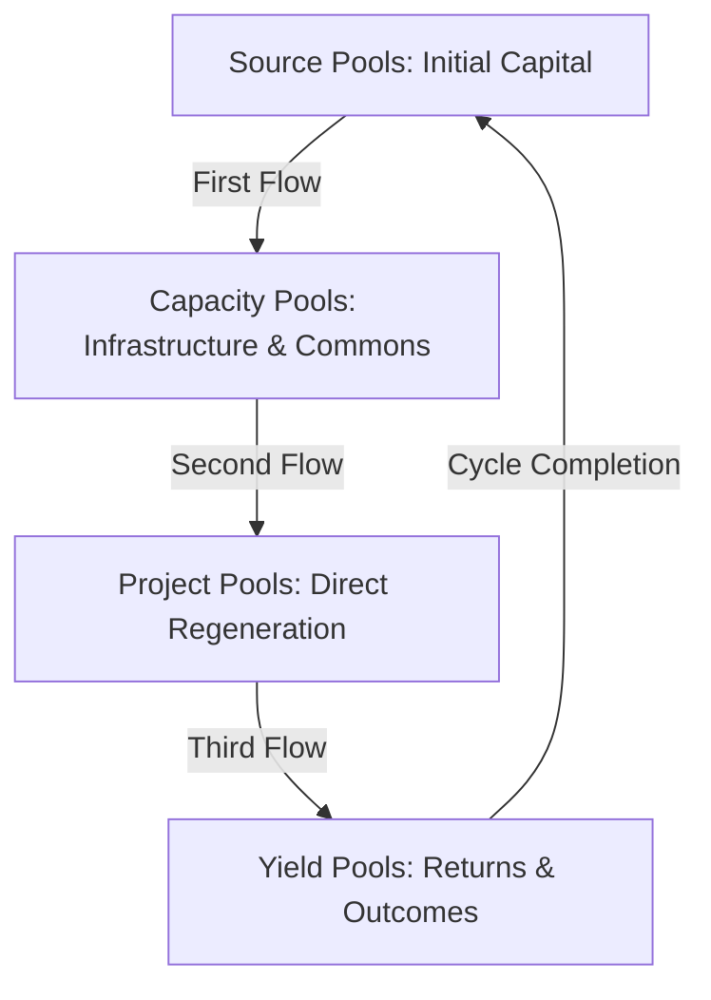

# Flow Funding and Resource Allocation

## Introduction: The Hydrological Perspective

In natural systems, the flow of water serves as perhaps the most essential circulation system—bringing nutrients, energy, and information throughout ecosystems. Similarly, the flow of resources in human systems determines which activities thrive and which wither. In regenerative systems, resource flows must mirror natural patterns: circular rather than linear, distributed rather than centralized, responsive rather than rigid.

ReFi Barcelona approaches funding and resource allocation through this hydrological lens—seeking to create flows that nourish the entire bioregional ecosystem rather than extracting from it. This article explores our innovative approaches to directing resources toward regenerative outcomes within the Catalan bioregion and beyond.

## Hypothesis: Regenerative Resource Flows

Our work on resource allocation is guided by a central hypothesis: **regenerative outcomes emerge when resources flow according to patterns that mirror natural systems, with distribution mechanisms that balance efficiency, equity, and ecosystem health**.

This hypothesis can be broken down into several testable propositions:

1. Participatory allocation mechanisms create more effective regenerative outcomes than centralized decision-making
2. Multi-capital approaches (recognizing more than financial value) generate more holistic regeneration
3. Transparent and traceable flows increase trust and participation in regenerative systems
4. Bioregionally-focused funding creates stronger local regenerative economies than globalized investment
5. Cyclical rather than linear funding models better support long-term ecosystem health

## Beyond Traditional Financing: The Multi-Capital Approach

Our approach begins by recognizing that financial capital represents only one type of resource necessary for bioregional regeneration. We consider at least five forms of capital that must flow appropriately:

| Capital Type | Description | Flow Mechanisms | Examples |
|--------------|-------------|-----------------|----------|
| Financial | Monetary resources | Grants, investments, currencies | Funding rounds, regenerative enterprises |
| Social | Trust, relationships, networks | Introductions, collaborations | Community exchanges, knowledge circles |
| Living | Biological resources and systems | Seeds, genetic diversity, ecosystem services | Seed libraries, biodiversity corridors |
| Knowledge | Information, practices, skills | Documentation, education, mentoring | Practice libraries, skill exchanges |
| Material | Physical assets and infrastructure | Sharing, circular systems | Tool libraries, shared workspaces |

Each form of capital requires appropriate channels, governance, and metrics to ensure it flows toward regenerative outcomes. Our funding and resource allocation systems are designed to facilitate all these capital types—not merely the financial dimension.

## Innovation in Financial Flow Mechanisms

While acknowledging the multi-capital approach, we recognize that financial resources often serve as an essential catalyst for other regenerative activities. Our innovation in financial flow mechanisms includes several key approaches:

### 1. Impact Quadratic Funding (ImpactQF)

Building on the quadratic funding mechanism pioneered by Gitcoin and others, we've developed Impact Quadratic Funding, which incorporates regenerative impact metrics into the resource allocation formula:

```
Project Allocation = (√Σ contributions²) × (Impact Factor)
```

Where Impact Factor is determined through a combination of:
- Verified ecological outcomes
- Social inclusion metrics
- Governance participation
- Knowledge commons contributions

This approach balances community preference signals (contributions) with measurable regenerative impact, creating a more holistic funding mechanism that rewards both popularity and effectiveness.

### 2. Bioregional Flow Pools

Rather than isolated funding instruments, we organize resources into interconnected "pools" that mirror watershed structures:



This structure ensures that resources support the entire regeneration system—from capacity building to direct action to benefit sharing. Each pool has appropriate governance and allocation mechanisms designed for its specific purpose.

### 3. Participatory Allocation Systems

We employ a range of participatory mechanisms for different funding contexts:

- **Community Round Tables**: For smaller, localized funding decisions
- **Quadratic Funding Rounds**: For distributed preference aggregation across many projects
- **Proposal Peer Review**: For technical funding requiring expert assessment
- **Milestone-Based Releasing**: For outcome-verified continuous funding
- **Delegated Funding Circles**: For rapid response to emerging opportunities

These approaches distribute decision-making appropriately while maintaining coherence with overall regenerative objectives.

### 4. Hybrid Currency Systems

Our funding approaches integrate traditional and alternative currencies to maximize regenerative impact:

- **Fiat Currency**: For mainstream economic interaction and regulatory compliance
- **Cryptocurrencies**: For transparent, borderless transactions and programmable funding
- **Community Currencies**: For localized economic circulation within bioregional boundaries
- **Reputation Systems**: For tracking non-financial contributions and trust
- **Natural Capital Credits**: For quantifying and exchanging ecological value

This hybrid approach allows resources to flow across different economic contexts while maintaining regenerative alignment.

## Case Study: The Catalonia Regenerative Funding Pilot

A concrete example of our approach is the Catalonia Regenerative Funding Pilot—our first bioregionally-focused funding mechanism designed specifically for Catalan regenerative initiatives.

This six-month pilot demonstrates our integrated approach:

**Design Phase**:
- Co-created with 15 regenerative projects across urban and rural Catalonia
- Developed context-appropriate impact metrics for Mediterranean bioregion
- Established multi-stakeholder governance including both funders and recipients
- Built technical infrastructure integrating on-chain and off-chain components

**Funding Sources**:
- €75,000 from institutional partners including local foundations
- €45,000 from individual contributions through matching pool
- €30,000 equivalent in complementary currencies and in-kind support
- Volunteer time valued at approximately €25,000

**Allocation Mechanisms**:
- 40% through Impact Quadratic Funding
- 30% through Participatory Milestone Funding
- 20% through Expert Panel Review
- 10% through Rapid Response Pool

**Results**:
- 22 projects funded across 7 Catalan counties
- Average project funding: €6,800 + non-financial support
- Leveraged an additional €180,000 in follow-on funding
- Created 13 formal collaboration agreements between projects

This pilot has provided valuable data on both the strengths and limitations of our approach, informing our ongoing development of bioregional funding mechanisms.

## Building the Financial Mycelium

Beyond specific funding rounds, we're developing what we call the "financial mycelium"—an interconnected network of funding and resource sharing mechanisms that create a resilient regenerative economy:

### 1. Regenerative Investment Circle

A peer-led investment group focusing on regenerative enterprises within the Catalan bioregion:
- 30+ individual and institutional members
- Monthly investment circles reviewing opportunities
- Due diligence shared across membership
- Blended financial and impact returns
- Focus on enterprises serving regenerative infrastructure

### 2. Common Resource Library

A system for sharing material resources across the bioregion:
- Digital platform tracking availability and condition
- Distributed storage nodes across urban and rural locations
- Maintenance and repair cooperative ensuring longevity
- Training programs for effective resource use
- Contribution tracking through reputation systems

### 3. Mediterranean Exchange Network

A cross-border system connecting Catalan regenerative economy with other Mediterranean nodes:
- Interoperable complementary currencies
- Joint funding rounds with ReFi Mediterranean partners
- Cross-border resource sharing protocols
- Harmonized impact metrics and verification
- Collective bargaining for larger funders and markets

### 4. Bioregional Backbone Infrastructure

Key systems providing essential services for regenerative resource flows:
- Logistics network for physical resource movement
- Information systems for opportunity and need matching
- Legal frameworks for innovative funding instruments
- Accounting tools for multi-capital tracking
- Educational resources for financial literacy

## Offchain-Onchain Integration: Technical Infrastructure

Our technical approach to enabling these regenerative flows combines both traditional and blockchain-based systems:

**Onchain Components**:
- Smart contracts for transparent fund allocation
- Multi-signature treasuries for collaborative management
- Token systems for participation tracking
- Verifiable credentials for impact claims
- Interoperable protocols for cross-network transactions

**Offchain Components**:
- Legal cooperative structure for regulatory compliance
- Traditional banking relationships for fiat on/off ramps
- Physical verification systems for ecological outcomes
- Community trust networks for social validation
- Educational systems for capacity building

This hybrid infrastructure allows us to leverage the strengths of both traditional and emerging systems while mitigating their respective limitations.

## From Resource Circulation to Regenerative Capital

A key distinction in our approach is the evolution from simple resource circulation to truly regenerative capital formation:

**Level 1: Resource Distribution**
- Directing existing resources toward regenerative projects
- Focus on efficient allocation and immediate impact
- Primarily grant-based with consumption of capital

**Level 2: Resource Circulation**
- Creating cycles where resources continuously flow
- Development of reciprocity mechanisms
- Mix of grants and recoverable funding

**Level 3: Regenerative Capital**
- Building systems that grow all capital forms
- Emphasis on generative rather than extractive returns
- Funding mechanisms that increase carrying capacity
- Integration of financial and natural capital cycles

Our current work spans all three levels, with increasing focus on Level 3 approaches that create truly regenerative capital rather than merely redistributing existing resources.

## Challenges and Tensions in Regenerative Funding

We recognize several persistent challenges in our funding approach:

- **Measuring Impact**: Quantifying complex ecological and social outcomes remains difficult
- **Regulatory Constraints**: Innovative funding mechanisms often face legal uncertainty
- **Technological Barriers**: Digital solutions can exclude certain participants
- **Time Horizons**: Regenerative returns often occur over longer timeframes than conventional investments
- **Wealth Inequality**: Pre-existing disparities influence who can participate in funding

We address these challenges through:
- Ongoing development of appropriate impact measurement systems
- Conservative legal approach with proper compliance
- Multiple participation pathways beyond digital
- Patient capital approaches with stakeholder education
- Deliberate inclusion mechanisms prioritizing underrepresented groups

## Metrics for Effective Resource Flows

We track the effectiveness of our funding approaches through several key metrics:

- **Flow Volume**: Total resources directed toward regenerative outcomes
- **Flow Distribution**: Geographic and demographic equity in resource allocation
- **Circulation Velocity**: How quickly and effectively resources move through the system
- **Leverage Ratio**: Additional resources catalyzed beyond direct funding
- **Regenerative Return**: Measurable ecological and social outcomes per unit of resource
- **Participation Rate**: Breadth and depth of stakeholder engagement in allocation decisions

These metrics help us continuously refine our approaches and demonstrate the value of regenerative resource flows.

## Strategic Intentions 2024-2026

Our medium-term intentions for resource allocation include:

1. Establish a permanent Catalonia Regenerative Fund with at least €500,000 annual deployment
2. Develop a comprehensive impact verification system specific to Mediterranean regenerative context
3. Create at least three bioregional investment vehicles connecting urban capital with rural regeneration
4. Implement a multi-capital accounting system across at least 20 regenerative initiatives
5. Launch a bioregional complementary currency with 1,000+ active participants

## Theoretical Foundations

Our approach to resource flows draws from several theoretical traditions:

- **Ecological Economics** (Herman Daly, Joshua Farley): Understanding economy within planetary boundaries
- **Commons Theory** (Elinor Ostrom): Governance systems for shared resources
- **Living Systems Theory** (Fritjof Capra): Applying natural patterns to human systems
- **Regenerative Economics** (John Fullerton): Creating capital that builds carrying capacity
- **Complementary Currency Systems** (Bernard Lietaer): Designing currencies for specific outcomes

These foundations are complemented by emerging frameworks from:
- **Tokenomics**: Design of incentive systems through digital tokens
- **DAO Treasury Management**: Collective governance of shared resources
- **ReFi**: Integration of regenerative outcomes with financial mechanisms
- **Impact Verification**: Measurement and validation of regenerative claims

## Conclusion: From Extractive to Regenerative Flows

The dominant economic system creates flows that extract value from living systems and concentrate it in financial instruments—a fundamental pattern driving ecological degradation and social inequality. Our work on regenerative resource allocation seeks to reverse this pattern, creating flows that nourish rather than deplete the living systems upon which we depend.

By developing and implementing innovative funding and resource allocation mechanisms, ReFi Barcelona aims to demonstrate that another economic model is possible—one that recognizes the true value of ecological health, community resilience, and bioregional vitality. These approaches form an essential component of our broader effort to create a regenerative economy within the Catalan bioregion.

Our ultimate vision is a comprehensive bioregional financial system where resource flows align with ecological patterns—creating abundance through regeneration rather than scarcity through extraction. This vision guides our ongoing experimentation with funding mechanisms, resource sharing systems, and multi-capital approaches that might serve as models for other bioregions worldwide.

---

*This article forms part of ReFi Barcelona's bioregional framework. For related perspectives, see our articles on [Collaborating in Wider Bioregions](collaborating-wider-bioregions.md) and [Building a Bioregional Financing Facility](building-bioregional-financing-facility.md).* 