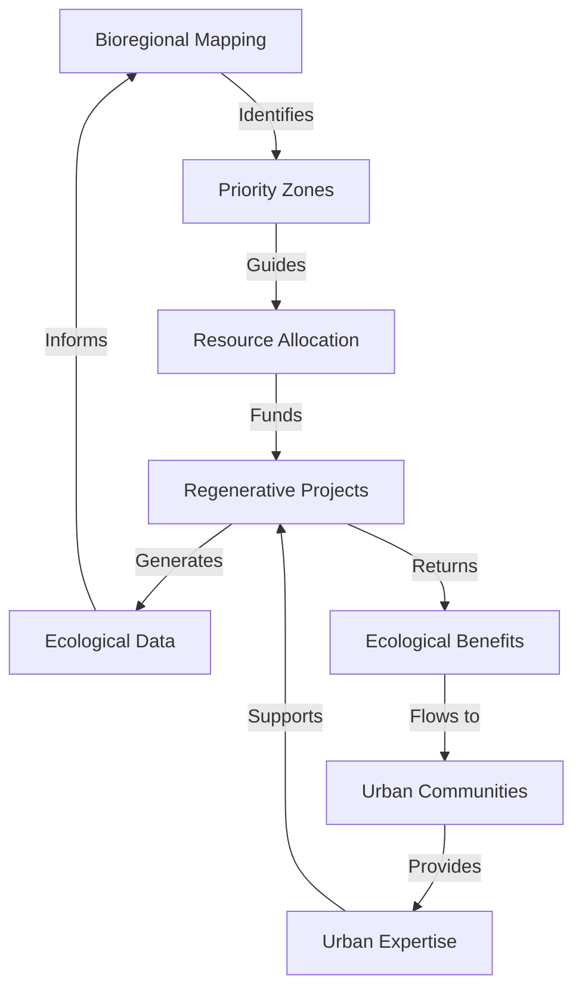

# Why a Bioregional Approach for ReFi BCN?

## Introduction: Transcending Urban Boundaries

The regenerative finance movement emerged largely from urban centers where technological innovation, financial expertise, and social capital converge. Yet the most vital regenerative work—ecosystem restoration, sustainable agriculture, and biodiversity enhancement—occurs primarily in rural landscapes. This spatial contradiction forms the foundation of ReFi Barcelona's bioregional approach.

## Core Hypothesis

We operate on a central hypothesis: **meaningful ecological regeneration can only occur when we align financial, social, and ecological flows with the natural boundaries of bioregions, rather than with arbitrary political or municipal divisions**.

This hypothesis contains several testable components:

1. Regenerative projects organized along bioregional boundaries will achieve greater ecological impact than those confined to municipal zones
2. Urban-rural collaboration increases the velocity and effectiveness of resource deployment for regeneration
3. Nature-based solutions require governance structures that mirror ecosystem patterns
4. Financial tools designed for bioregional purposes will outperform conventional financial instruments in generating ecological returns

## The Barcelona Paradox

Barcelona presents a fascinating case study in regenerative paradoxes:

- The city houses world-class expertise in sustainability, urban ecology, and systems thinking
- Leading cooperatives, social economy networks, and commons-based initiatives thrive here
- Urban density creates financial, social, and technological capital concentrations
- Yet meaningful ecological regeneration must occur beyond city limits, where the actual biophysical assets exist

Data supports this paradox. Barcelona municipality covers just 101.4 km², while the functional Catalan bioregion encompasses approximately 32,108 km². This 300:1 ratio illustrates the spatial mismatch between urban centers of innovation and the territories requiring regeneration.

## Moving Beyond Green Urbanism

We recognize the limitations of conventional urban sustainability approaches:

- **Urban greening**: While beneficial, green roofs and urban gardens are insufficient to address watershed-scale degradation
- **Urban farming**: Important for education and food security, but cannot replace regenerative agriculture at scale
- **Carbon offsets**: Often displace responsibility rather than creating systemic transformation
- **ESG investing**: Typically remains trapped in extractive financial paradigms

Our bioregional approach seeks to transcend these limitations by establishing direct connections between urban resources and rural regeneration.

## The Mediterranean Context

The Mediterranean basin represents one of the world's biodiversity hotspots, with:

- 25,000+ plant species (50% endemic)
- Critical ecosystem services valued at €9,400 per hectare annually
- 5,000+ years of human-nature co-evolution creating unique agrarian landscapes

Yet this region faces accelerating threats:

- 250+ million tourists annually creating seasonal ecological pressure
- Coastal development destroying critical habitats
- Agricultural intensification depleting soil and water
- Climate change intensifying drought and fire risks

This context demands regional approaches that transcend individual city initiatives.

## Our Intentions

Through our bioregional approach, ReFi BCN intends to:

1. **Recognition**: Acknowledge the Catalan bioregion as our operative scope, encompassing Mediterranean coastal zones, Pyrenean foothills, inland plains, and river watersheds
2. **Connection**: Establish formal pathways connecting urban resources with rural regeneration needs
3. **Circulation**: Create mechanisms for the continuous flow of knowledge, capital, and talent between urban and rural contexts
4. **Amplification**: Magnify the impact of existing initiatives by embedding them in bioregional networks
5. **Transformation**: Shift resource allocation patterns from extractive to regenerative purposes

## Theoretical Foundations

Our bioregional approach draws from several theoretical traditions:

- **Bioregionalism** (Peter Berg, Raymond Dasmann): Organizing human activity along ecological boundaries
- **Social Ecology** (Murray Bookchin): Linking social organization to ecological principles
- **Systems Thinking** (Donella Meadows): Understanding feedback loops between social and ecological systems
- **Commons Theory** (Elinor Ostrom): Developing governance for shared ecological resources
- **Regenerative Economics** (John Fullerton): Creating circular flows that rebuild natural capital

These foundations are complemented by emerging frameworks from:

- **Token Engineering**: Designing incentive structures for collaborative ecological stewardship
- **DeFi**: Creating liquid markets for regenerative assets
- **DAO governance**: Enabling cross-boundary coordination for ecosystem management

## Early Evidence

Several precedents validate our bioregional hypothesis:

- The Valencian l'Horta agricultural commons demonstrates how urban-rural connections preserve productive landscapes
- The Montseny Biosphere Reserve illustrates successful watershed-scale governance
- The Garrotxa Volcanic Zone exemplifies tourism that regenerates rather than extracts

## Challenges and Tensions

We acknowledge several tensions in our bioregional approach:

- **Authority gaps**: Bioregions rarely align with administrative boundaries, creating governance challenges
- **Urban primacy**: Risk of urban agendas dominating rural needs in resource allocation
- **Measurement complexity**: Ecological outcomes are harder to quantify than financial returns
- **Temporal mismatches**: Ecological regeneration operates on longer timescales than urban innovation cycles

## Methodological Approach

Our approach implements bioregionalism through several methodologies:

This circular methodology ensures continuous learning and adaptation.

## Conclusion: Beyond Barcelona

While our name anchors us in Barcelona, our vision and impact stretch across the Catalan bioregion. By acknowledging this spatial relationship, we position ourselves honestly within the ecological reality—Barcelona as a node within a larger living system, rather than as the center of regenerative activity.

In doing so, we transform what could be a limitation (urban location) into an opportunity for bridging divided contexts, cultures, and resources in service of whole-system regeneration.

---

*This article forms part of ReFi Barcelona's bioregional framework. For related perspectives, see our articles on [Creating Roots in the Territory](creating-roots-territory.md) and [Bridging the Urban-Rural Divide](bridging-urban-rural-divide.md).* 