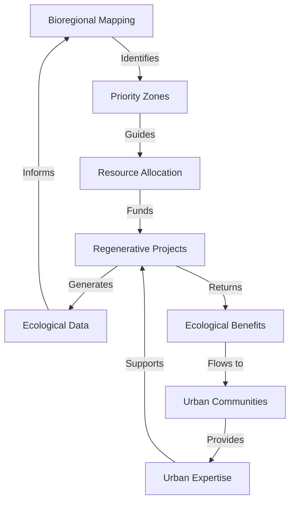

# Why a Bioregional Approach for ReFi BCN?

## Introduction: Transcending Urban Boundaries

The regenerative finance movement emerged largely from urban centers where technological innovation, financial expertise, and social capital converge. Yet the most vital regenerative work—ecosystem restoration, sustainable agriculture, and biodiversity enhancement—occurs primarily in rural landscapes. This spatial contradiction forms the foundation of ReFi Barcelona's bioregional approach.

## Core Hypothesis

We operate on a central hypothesis: **meaningful ecological regeneration can only occur when we align financial, social, and ecological flows with the natural boundaries of bioregions, rather than with arbitrary political or municipal divisions**.

This hypothesis contains several testable components:

1. Regenerative projects organized along bioregional boundaries will achieve greater ecological impact than those confined to municipal zones
2. Urban-rural collaboration increases the velocity and effectiveness of resource deployment for regeneration
3. Nature-based solutions require governance structures that mirror ecosystem patterns
4. Financial tools designed for bioregional purposes will outperform conventional financial instruments in generating ecological returns

## Early Evidence

Several precedents validate our bioregional hypothesis:

- The Valencian l'Horta agricultural commons demonstrates how urban-rural connections preserve productive landscapes
- The Montseny Biosphere Reserve illustrates successful watershed-scale governance
- The Garrotxa Volcanic Zone exemplifies tourism that regenerates rather than extracts

## Challenges and Tensions

We acknowledge several tensions in our bioregional approach:

- **Authority gaps**: Bioregions rarely align with administrative boundaries, creating governance challenges
- **Urban primacy**: Risk of urban agendas dominating rural needs in resource allocation
- **Measurement complexity**: Ecological outcomes are harder to quantify than financial returns
- **Temporal mismatches**: Ecological regeneration operates on longer timescales than urban innovation cycles

## Methodological Approach

Our approach implements bioregionalism through several methodologies:

This circular methodology ensures continuous learning and adaptation.

## Conclusion: Beyond Barcelona

While our name anchors us in Barcelona, our vision and impact stretch across the Catalan bioregion. By acknowledging this spatial relationship, we position ourselves honestly within the ecological reality—Barcelona as a node within a larger living system, rather than as the center of regenerative activity.

In doing so, we transform what could be a limitation (urban location) into an opportunity for bridging divided contexts, cultures, and resources in service of whole-system regeneration.

---

*This article forms part of ReFi Barcelona's bioregional framework. For related perspectives, see our articles on [Creating Roots in the Territory](creating-roots-territory.md) and [Bridging the Urban-Rural Divide](bridging-urban-rural-divide.md).* 