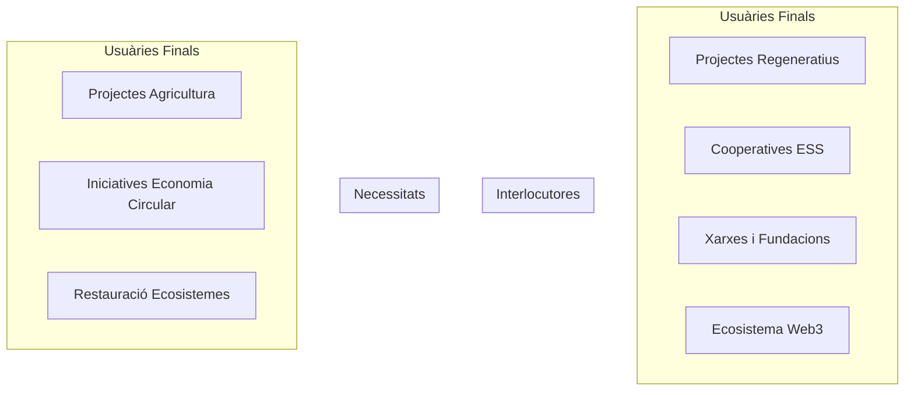
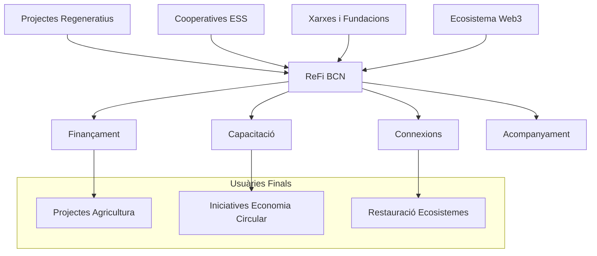
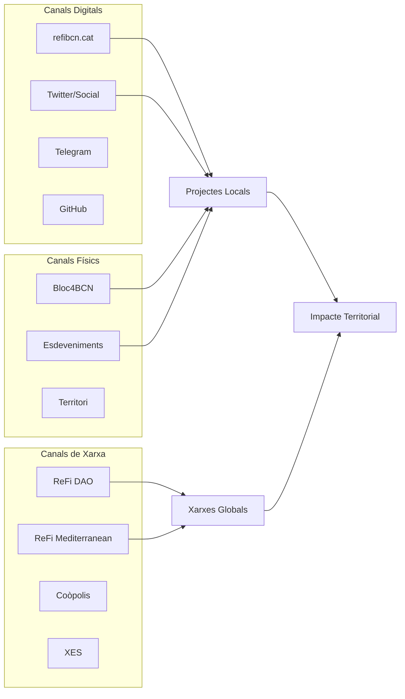
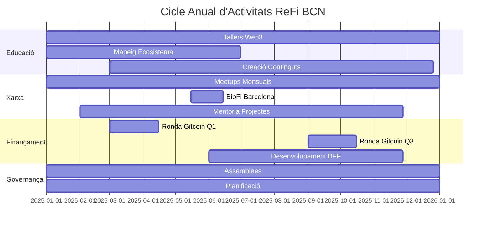
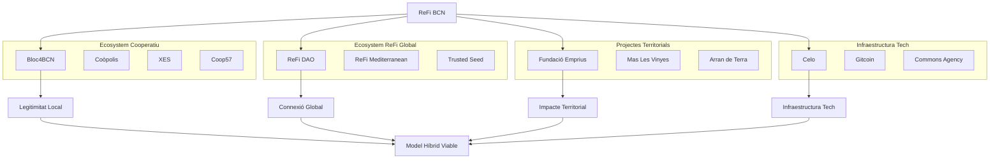
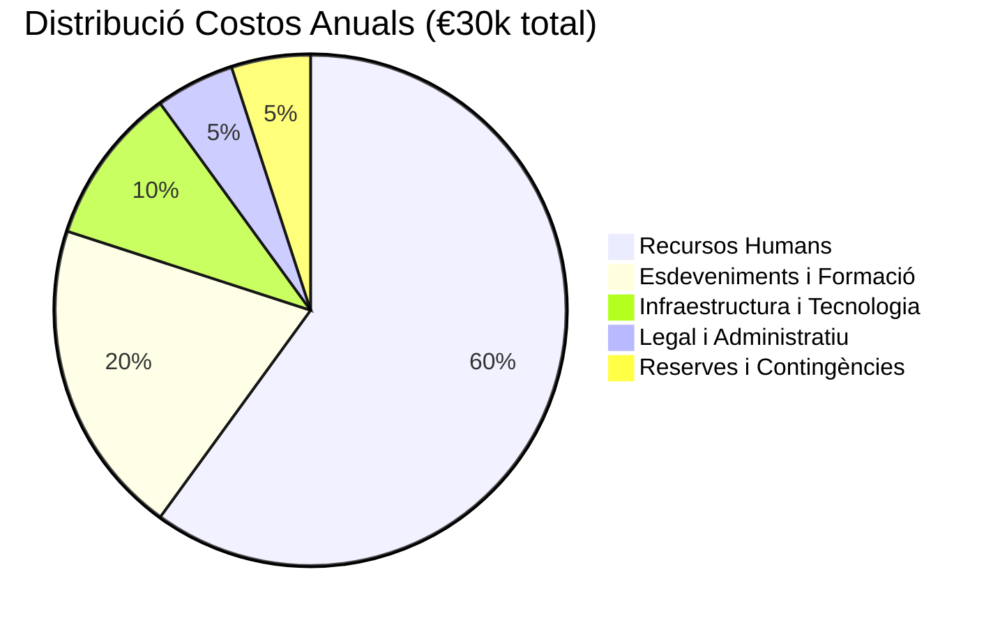
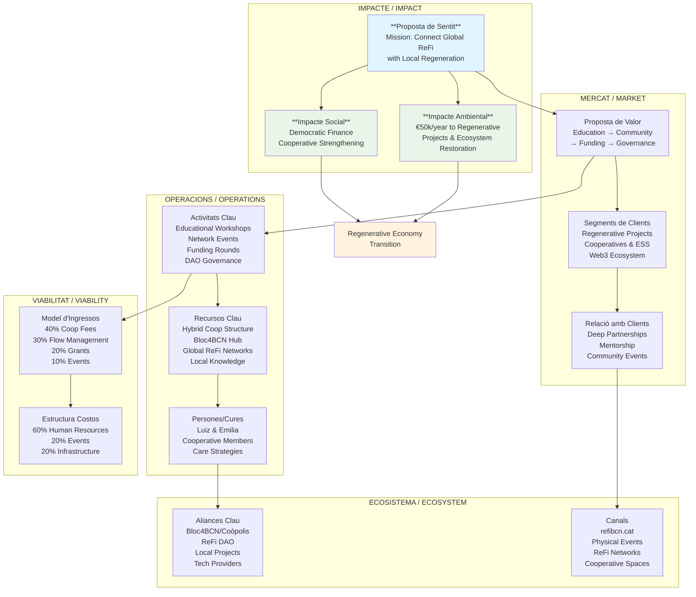

# Canvas Social

Status: In progress
Owner: luizfernando
Parent project: Incubació i Constitució de la Cooperativa | Bloc4 (https://www.notion.so/Incubaci-i-Constituci-de-la-Cooperativa-Bloc4-13a6ed0845cb80b0a032d43f9f7ba9f4?pvs=21)

<aside>
🎨

**Miro board**

https://miro.com/app/board/uXjVIsvKgUI=/

</aside>

## Canvas Social - ReFi BCN

## Introducció / Introduction

Aquest document serveix com a plantilla per desenvolupar el Canvas Social de ReFi BCN, una eina per mapear i estructurar el nostre model de negoci social.

*This document serves as a template to develop ReFi BCN's Social Canvas, a tool to map and structure our social business model.*

---

# 1. ReFi BCN - *què / per què?*

## 1. Proposta de Sentit / Impacte

### Value/Impact Proposal

**Pregunta clau:** Quin és el nostre propòsit? Quin impacte volem generar?
**Key question:** What is our purpose? What impact do we want to generate?

**Main Mission:**

To catalyze the flow of regenerative capital, knowledge, and governance practices by bridging global Web3/ReFi networks with local ecosocial transition actors in Catalonia — fostering the emergence of a resilient, bioregional regenerative economy.

**Main Hypothesis (Enhanced):**

The ecosocial transition requires fundamentally new streams of capital and coordination mechanisms to bridge the critical gap of funds and resources needed, overcoming structural dependence on increasingly constrained public funds and supporting the resilience and expansion of the social and solidarity economy.

**Core Problem Statement:**

Current funding ecosystems are inadequate for the scale, speed, and systemic nature of the ecosocial transition. The social and solidarity economy (ESS), despite being a proven model for regenerative and equitable development, faces chronic under-capitalization due to:

1. **Structural Funding Gaps**: Traditional finance prioritizes extractive returns over regenerative impact
2. **Public Fund Constraints**: Austerity policies and competing priorities limit available public resources
3. **Coordination Failures**: Fragmented initiatives operate in isolation, reducing collective impact
4. **Scale Mismatches**: Global capital flows disconnect from local implementation needs

**Supporting Evidence & Context:**

**Systemic Fragility & Opportunity:**
- **Economic Vulnerability**: Increasing fragility of globalized systems (supply chain disruptions, economic volatility, climate breakdown) creates urgent demand for resilient, locally-driven alternatives
- **Institutional Gaps**: Widespread budget cuts and shifting public service models expose cracks in current systems, highlighting the need for innovative financing mechanisms
- **ESS Resilience**: The cooperative and social economy sectors have proven more resilient during crises (COVID-19, 2008 financial crisis) yet remain chronically underfunded

**Proven Market Demand & Innovation:**
- **Web3 Adoption**: Explosive growth in localized Web3 adoption (Celo's MiniPay: 7M+ wallet activations across 50+ countries, onchain local currencies like cUSD, cKES, cGHC)
- **Funding Ecosystem Maturity**: Over $370,000 raised and distributed through local/bioregional rounds in past year, demonstrating both demand and delivery capacity
- **Coordination Innovation**: Emerging coordination mechanisms (DAOs, quadratic funding, impact measurement tools) show promise for addressing traditional funding inefficiencies

**Coordination Challenges & Solutions:**
- **Fragmentation Problem**: Decentralized ecosystems and local initiatives often lack coordination structures, limiting collective impact and resource efficiency
- **Information Asymmetries**: Funders lack access to quality local projects; local projects lack access to diverse funding sources
- **Capacity Gaps**: ESS organizations need support to access and manage new funding mechanisms

**Hypothesis Dimensions:**

**1. Capital Diversification & Access**
- **Problem**: Over-reliance on public funds creates vulnerability to political changes and budget constraints
- **Solution**: Develop hybrid funding ecosystems that blend Web3 innovation (quadratic funding, DAOs, crypto-philanthropy) with cooperative finance, impact investment, and decentralized mechanisms
- **Evidence**: Successful examples like Kolektivo Curaçao, Celo Community Fund, and local Gitcoin rounds demonstrate viability

**2. Coordination Infrastructure**
- **Problem**: Fragmented initiatives operate in isolation, reducing efficiency and collective impact
- **Solution**: Create coordination mechanisms that connect local projects with global networks while maintaining territorial rootedness
- **Evidence**: ReFi Mediterranean network, Regen Coordination initiatives, and bioregional approaches showing early success

**3. Institutional Innovation**
- **Problem**: Traditional funding structures (grants, loans) don't match the collaborative, commons-based nature of ESS
- **Solution**: Develop new institutional forms that combine cooperative governance with Web3 tools (hybrid cooperatives, BFFs, community-owned infrastructure)
- **Evidence**: Emerging models like Bioregional Financing Facilities, DAO-cooperative hybrids, and community-owned financial infrastructure

**4. Capacity & Bridge Building**
- **Problem**: Skills and knowledge gaps prevent ESS organizations from accessing new funding mechanisms
- **Solution**: Build comprehensive support ecosystems that translate between traditional ESS practices and Web3 innovation
- **Evidence**: Growing demand for Web3 education in cooperative sectors, successful hybrid models in Barcelona and other cities

**Theory of Change - Expanded:**

**Phase 1: Foundation Building**
- **Hybrid Financial Infrastructure**: Design and manage financial systems that blend Web3 innovation with cooperative structures and traditional funding, creating transparent, participatory resource allocation
- **Capacity Ecosystem**: Build comprehensive support systems (consulting, training, research) that strengthen regenerative initiatives and enable effective utilization of new financial tools

**Phase 2: Territorial Embedding**
- **Local Integration**: Embed blockchain infrastructure into local economic fabric through stablecoins, payment systems, and governance tools that solve real community problems
- **Coordination Networks**: Create coordination mechanisms that connect fragmented local initiatives into coherent, scalable movements with greater collective impact

**Phase 3: Systemic Transformation**
- **Bioregional Scaling**: Develop and prototype Bioregional Financing Facilities (BFF) that support systemic, place-based investment in social and ecological resilience
- **Policy Integration**: Influence public policy to create enabling environments for hybrid funding models and ESS innovation

**Critical Success Factors:**

- **Trust & Legitimacy**: Maintain credibility with both traditional ESS actors and Web3 innovators
- **Cultural Translation**: Effectively bridge different organizational cultures and technical languages
- **Demonstrated Impact**: Prove that new mechanisms actually deliver better outcomes for communities
- **Scalable Models**: Develop approaches that can be replicated across different bioregions and contexts

**Risk Mitigation:**

- **Technology Risk**: Focus on proven, accessible technologies rather than experimental ones
- **Regulatory Risk**: Work within existing cooperative legal frameworks while advocating for policy updates
- **Community Risk**: Ensure genuine participation and benefit-sharing, avoiding extractive or gentrifying effects
- **Sustainability Risk**: Build diversified funding models that don't depend on any single source

**Impacte Aspiracional / Aspirational Impact:**

- Funcionar com a pont entre xarxes globals ReFi i regeneradors locals
- Transició cap a una economia regenerativa a Catalunya
- Fortaliment de la resiliència financera de les iniciatives locals de transició ecosocial
- Model cooperatiu replicable per a altres nodes ReFi locals i bioregionals

## 3. Proposta de Valor (Serveis)

### Value Proposition

**Pregunta clau:** Quina és la nostra oferta (productes, serveis o experiències)?
**Key question:** What is our offering (products, services or experiences)?

<aside>

### Main Value Proposition:

ReFi Barcelona offers applied services that enable regenerative initiatives to access and manage funding, build capacity, and collaborate effectively — through a hybrid model that bridges cooperative structures with Web3 tools.

</aside>

<aside>

### **Unique Value Propositions**

- **Hybrid Infrastructure**: ReFi Barcelona is one of the few nodes globally combining the legal and social legitimacy of a cooperative with the financial and governance tools of Web3.
- **Rooted in Territory**: We work from a deep understanding of the Catalan cooperative and ESS ecosystem, ensuring that all tools and services are grounded in local realities.
- **Bridge Between Worlds**: We connect regenerative actors in Catalonia with global ReFi protocols, funding opportunities, and innovation networks — while translating these tools into accessible, culturally appropriate formats.
- **Bioregional Focus**: Our approach is systemic and place-based, supporting regeneration across ecosystems, not just organizations. We design models that are replicable for other Mediterranean (with which we are in closer contact) or bioregional contexts.
- **Orchestrator Role**: We do not act as a centralizing institution but as a relational facilitator — aligning actors, funding, and infrastructure to activate collective capacity.
</aside>

### **Service Categories:**

<aside>

### **1. Technical and Financial Management of Funding Infrastructures**

- Design and coordination of community-led funding programs, such as local Gitcoin rounds and DAO-based fund pools.
- Management of flows within a Bioregional Financial Infrastructure, ensuring transparent, participatory allocation.
- Fiscal hosting, fund disbursement logistics, and legal-technical bridging between Web3 tools and local actors.

**Examples:**

Implementation of local quadratic funding rounds; co-creation of shared infrastructure (e.g., Bioregional Financing Facility - BFF); technical integration of wallets, smart contracts, and cooperative oversight.

</aside>

<aside>

### **2. Fundraising Support**

- Guidance to regenerative projects and cooperatives on accessing grants and ethical finance (Web3, public, or cooperative sources).
- Strategic positioning and matchmaking between funders and grassroots initiatives.
- Support in structuring applications and aligning with impact metrics.

**Examples:**

Support with Gitcoin, Celo, or DAO grants; advisory on impact funding streams for agroecology, circular economy, or ecosystem restoration.

</aside>

<aside>

### **3. Technical Consulting and Capacity Building**

- Tailored workshops and one-on-one consulting for local cooperatives and regenerative actors on Web3, governance, and financial innovation.
- Training sessions to navigate ReFi tools (e.g. multisig wallets, DAOs, funding protocols) and their practical application.
- Strategic facilitation for cooperatives looking to evolve with distributed governance.

**Examples:**

Intro to regenerative finance sessions; DAO co-design with cooperatives; wallet setup and shared governance onboarding.

</aside>

<aside>

### **4. Events**

- Organization of curated events designed to connect actors across territories and disciplines.
- Facilitation of retreats, domain-specific roundtables, and immersive educational gatherings.
- Events function both as knowledge spaces and as activation points for funding, collaboration, or shared infrastructure.

**Examples:**

BioFi Barcelona; skill-building meetups; expert convenings on cooperative finance or local currencies.

</aside>

<aside>

### **5. Research and Development**

- Co-creation of knowledge products: mappings, guides, and practical toolkits based on the needs of local actors.
- Applied research on funding needs, governance mechanisms, and regenerative metrics.
- Partnership with universities and practitioners to test and iterate regenerative financial models.

**Examples:**

Integration of research with pilot programs; community-based documentation of impact; open-source toolkits contextualized for the Catalan ESS.

</aside>

---

# 2. ReFi BCN - *a qui?*

## 2. Segments de Clients i Usuaris

### Customer and User Segments

**Pregunta clau:** Qui són els clients i usuaris? Quines són les seves necessitats? A qui ens dirigim?
**Key question:** Who are our clients and users? What are their needs? Who are we targeting?

**Segments Primaris / Primary Segments:**

- **A. Projectes Regeneratius Territorials**: Iniciatives d'agricultura regenerativa, restauració d'ecosistemes, economia circular
- **B. Cooperatives i ESS**: Cooperatives de treball, habitatge, consum; empreses socials establertes
- **C. Xarxes i Fundacions**: Organizacions que agreguen i donen suport a projectes locals
- **D. Ecosistema Web3/ReFi**: Protocols, DAOs i projectes blockchain amb focus regeneratiu

**Segments Secundaris / Secondary Segments:**

- **E. Institucions Públiques**: Ajuntaments, Generalitat, entitats supramunicipals
- **F. Finançament Ètic**: Bancs cooperatius, fundacions, inversors d'impacte

**Perfils Específics / Specific Profiles:**

**Territorials:**
- Fundació Emprius (economia circular)
- Mas Les Vinyes (agricultura regenerativa)
- Arran de Terra (agricultura regenerativa)

**Web3/ReFi Ecosystem:**
- Celo (infraestructura blockchain)
- Gitcoin (finançament quadràtic)
- Ma Earth (regeneració ecosistèmica)
- Bloom Network (comunitats regeneratives)
- AgroforestDAO (foresteria regenerativa)

**Nodes Locals Similars:**
- ReFi Medellín (Colòmbia)
- Regen Rio (Brasil)
- Regenerate Cascadia (Pacific Northwest)
- Celo Colombia (xarxa local)
- Kolektivo Curacao (economia circular)

**Cooperatiu i ESS:**
- Coop57 (finançament cooperatiu)
- Fundació Seira (desenvolupament cooperatiu)
- Fiare Banca Etica (finançament ètic)

**Necessitats per Segment / Needs per Segment:**

- **A&B**: Accés a finançament, capacitació en Web3, acompanyament tècnic
- **C**: Eines per canalitzar recursos, connexions globals, amplificació d'impacte
- **D**: Connexió amb impacte territorial real, validació de projectes locals
- **E&F**: Models innovadors de finançament, transparència, mesura d'impacte





GQ note: as they care about the distinction between users and clients, I would add some comments about it (and we can ask)

in our case I think all the stakeholders mentioned here can and will be both depending on the situation:

usually reg projects are users, as the funds come from other entities, but in this case the entities providing funding are clients or what? I dont think it fits well in this distinction, but anyway we can mention this :

For certain activities it’s simple to define users and in these situations they are also clients : as for exampe entities paying for consulting / events participation / direct support 

For what I call “Technical/Financial management of financial programs and infrastructures”, there are users but not much “clients”, we are coordinating different funds and interests in a way that direct funds to regeneration

## 4. Relació amb Clients

### Customer Relationships

**Pregunta clau:** Com ens relacionem amb els nostres clients?
**Key question:** How do we relate to our customers?

**Tipus de Relacions per Segment:**

- **Relacions Profundes / Deep Relationships:**
    - **Membres Cooperativa**: Gouvernança democràtica, participació en decisions, propietat compartida
    - **Projectes Partner**: Acords formals, suport continuu, desenvolupament conjunt de propostes
- **Relacions d'Acompanyament / Accompaniment Relationships:**
    - **Mentoria Personalitzada**: Suport 1:1 per projectes en desenvolupament
    - **Consultoria Tècnica**: Assessorament especialitzat en Web3, governança, finançament
    - **Programes d'Incubació**: Procés estructurat per desenvolupar capacitats
- **Relacions Comunitàries / Community Relationships:**
    - **Esdeveniments Regulars**: Trobades mensuals, tallers trimestrals, retirs anuals
    - **Espais d'Aprenentatge**: Sessions formatives, intercanvi d'experiències
    - **Plataformes Digitals**: Telegram, fòrums, repositoris de coneixement
- **Relacions de Xarxa / Network Relationships:**
    - **Connexions Estratègiques**: Facilitació de trobades entre actors complementaris
    - **Col·laboracions Internacionals**: Connexió amb altres nodes ReFi Mediterranean
    - **Aliances Institucionals**: Relacions amb administracions públiques i fundacions
- **Mecanismes de Cura / Care Mechanisms:**
    - Seguiment personalitzat del benestar dels membres
    - Espais de suport mutu i resolució de conflictes
    - Reconeixement i celebració d'èxits col·lectius

## 5. Canals

### Channels

**Pregunta clau:** A través de quins canals ens relacionem? Com fem arribar la nostra proposta (distribució)?
**Key question:** Through which channels do we relate? How do we deliver our proposition (distribution)?

**Canals Digitals / Digital Channels:**

- **Web/Knowledge Base**: refibcn.cat (mapes d'ecosistemes, recursos)
- **Xarxes Socials**: Twitter @ReFiBCN, LinkedIn, Telegram
- **Plataformes Web3**: Gitcoin, Discord communities, DAO tools
- **Repositoris Oberts**: GitHub, documents col·laboratius

**Canals Físics / Physical Channels:**

- **Bloc4BCN**: Seu física a l'hub cooperatiu més gran d'Europa
- **Esdeveniments Propis**: ReFi Unconference, BioFi Barcelona
- **Espais Cooperatius**: Xarxa d'Ateneus Cooperatius, CoòpoliS
- **Territori**: Visites a projectes, treball de camp bioregional

**Canals de Xarxa / Network Channels:**

- **ReFi DAO**: Connexió amb xarxa global
- **ReFi Mediterranean**: Col·laboració bioregional
- **Coòpolis**: Incubadora cooperativa oficial
- **Xarxa d'Economia Solidària (XES)**: Ecosistema ESS català

**Canals d'Esdeveniments / Event Channels:**

- **Trobades Regulars**: Meetups mensuals, jornades trimestrals
- **Tallers Formatius**: Sessions especialitzades per temàtica
- **Conferències**: Participació en esdeveniments del sector
- **Retirs**: Experiències immersives de formació i connexió



---

# 3. ReFi BCN - *com?*

## 8. Activitats Clau

### Key Activities

**Pregunta clau:** Quines activitats necessitem per generar la nostra proposta de valor per als clients?
**Key question:** What activities do we need to generate our value proposition for clients?

**Activitats Educatives / Educational Activities:**

- **Tallers Web3 per ESS**: Sessions mensuals sobre blockchain, DeFi, DAOs
- **Seminaris ReFi**: Formació en finances regeneratives i mecanismes innovadors
- **Creació de Continguts**: Guies, casos d'estudi, traduccions al català
- **Mapeig d'Ecosistemes**: Investigació i documentació d'actors locals

**Activitats de Xarxa / Network Activities:**

- **Esdeveniments Regulars**: ReFi Meetups, BioFi Barcelona, Unconference
- **Programes de Mentoria**: Acompanyament 1:1 a projectes
- **Connexions Estratègiques**: Facilitació de trobades entre actors
- **Col·laboracions Internacionals**: Participació en ReFi Mediterranean

**Activitats de Finançament / Funding Activities:**

- **Rondes Gitcoin**: Organització de finançament quadràtic local
- **Assessorament Grant**: Suport en aplicacions a subvencions Web3
- **Desenvolupament BFF**: Creació d'infraestructura financera bioregional
- **Gestió de Fluxos**: Intermediació entre finançadors i projectes
- **AI ImpactQF**: Implementació de mecanismes de finançament quadràtic amb avaluació d'impacte assistida per IA
- **TVF Tracking**: Seguiment de Total Value Flowed per mesurar circulació de capital dins les xarxes Web3 locals
- **Local Matching Programs**: Desenvolupament de programes que combinen finançament Web3 amb recursos municipals i locals

**Activitats de Mesura i Seguiment / Measurement and Tracking Activities:**

- **Karma GAP Integration**: Implementació de seguiment d'impacte onchain i reporting transparent
- **Prosperity Pass Deployment**: Desplegament de sistemes d'identitat que vinculen múltiples wallets per avaluar l'activitat econòmica comunitària
- **Regional SWOT Analysis**: Anàlisi de fortaleses, debilitats, oportunitats i amenaces per l'adopció Web3 en diferents regions
- **Onchain Impact Reporting**: Desenvolupament de sistemes transparents de mesura d'impacte utilitzant Common Approach standards

**Activitats de Governança / Governance Activities:**

- **Assemblees Cooperativa**: Decisions democràtiques mensuals
- **Facilitació DAO**: Implementació d'eines governance distribuïda
- **Resolució Conflictes**: Mediació i suport en dinàmiques grupals
- **Planificació Estratègica**: Sessions trimestrals de revisió i adaptació



## 9. Recursos Clau

### Key Resources

**Pregunta clau:** Amb quins recursos i capacitats comptem per generar la nostra proposta?
**Key question:** What resources and capacities do we have to generate our proposition?

**Recursos Humans / Human Resources:**

- **Equip Nucli**: Luiz Fernando (Coordinator), Emilia Sierra (Community Lead), Giulio Quarta
- **Membres Cooperativa**: Experts en cooperativisme, Web3, desenvolupament territorial
- **Xarxa de Mentors**: Professionals ReFi DAO, Trusted Seed, cooperatives establertes
- **Col·laboradors Ocasionals**: Facilitadors, consultors especialitzats

**Recursos Institucionals / Institutional Resources:**

- **Estructura Legal**: Cooperativa SCCL (en constitució via Coòpolis)
- **Seu Física**: Espai a Bloc4BCN (40+ cooperatives, infraestructura compartida)
- **Reconeixement**: Incubació oficial per Coòpolis Barcelona
- **Xarxes**: Integració en XES, ReFi DAO, ReFi Mediterranean

**Recursos Tecnològics / Technological Resources:**

- **Infraestructura Digital**: Web refibcn.cat, repositoris GitHub, plataformes col·laboratives
- **Eines Web3**: Wallets multi-sig, plataformes DAO, protocols DeFi
- **Plataformes Educatives**: Materials formatius, documentació tècnica
- **Sistemes de Comunicació**: Telegram, Discord, mailing lists

**Recursos Financers / Financial Resources:**

- **Capital Inicial**: Aportacions fundadors (€2-5k)
- **Línies de Crèdit**: Accés a Coop57, Fiare (fins €20k)
- **Grants Actius**: Finançament ReFi DAO, aplicacions Gitcoin
- **Fluxos Recurrents**: Quotes membres, primers ingressos serveis

**Recursos de Coneixement / Knowledge Resources:**

- **Knowledge Base**: Mapes d'ecosistemes, guies pràctiques, casos d'estudi
- **Experiència Acumulada**: 2+ anys organitzant comunitat ReFi Barcelona
- **Connexions Globals**: Accés directe a xarxes i experts internacionals
- **Context Local**: Coneixement profund ESS catalana, relacions establertes

**Altres Recursos Estratègics / Other Strategic Resources:**

- **Reputació**: Reconeixement com a node pioner híbrid cooperativa-Web3
- **Momentum**: Creixement orgànic comunitat i demanda serveis
- **Localització**: Barcelona com a hub innovació i cooperativisme
- **Timing**: Convergència entre maduresa ReFi i necessitats ESS local

## 10. Persones / Cures

### People / Care

**Pregunta clau:** Amb quines persones comptem? Quines capacitats tenen? Quines necessiten? Com les cuidem?
**Key question:** What people do we count on? What capacities do they have? What do they need? How do we care for them?

**Equip Actual / Current Team:**

- **Luiz Fernando Gomez Segala** - Fundador & Coordinador
    - *Capacitats*: Core Steward ReFi DAO, experiència Web3, construcció comunitats
    - *Dedicació*: 60% temps, coordinació general, relacions externes
    - *Necessitats*: Suport administratiu, delegació operativa, equilibri vida-treball
- **Emilia Sierra Guzmán** - Community Lead
    - *Capacitats*: Branding, estratègia d'impacte, educació, connexió amb terra
    - *Dedicació*: 40% temps, desenvolupament comunitat, comunicació
    - *Necessitats*: Formació tècnica Web3, suport creativitat, espais reflexió
- **Giulio**
- config
    
    —Luiz is going to deal with strategy, connection to international networks, financial management, tech stack, technical operations, research and fundraising (these last two, I think they are equally done by the both of us, I wouldn't put them for neither, there is already enough stuff to list)
    
    - > role I would assign on the canvas : Founder, Director, Finance and Tech Lead
    
    —Giulio is going to deal with partnerships and partners cultivation on the ground, public relationships, connection to local/bioregional networks, activities coordination, research and fundraising
    
    - > role : Activities Coordinator and Public Relationships
    
    —Emilia is going to deal with marketing strategy, branding and media editing, community, education
    
    - > role : Community and Marketing Lead

**Membres Cooperativa Fundadors** (5-8 persones)

- *Capacitats Diverses*: Cooperativisme, desenvolupament territorial, tecnologia, ESS
- *Dedicació*: Variable (10-30% temps segons disponibilitat)
- *Necessitats*: Formació governança DAO, clarificació rols, compensació gradual

**Xarxa de Col·laboradors** (15-20 persones)

- *Capacitats*: Facilitació, consultoria especialitzada, connexions sectorials
- *Dedicació*: Projectes específics, col·laboracions puntuals
- *Necessitats*: Oportunitats col·laboració, reconeixement, desenvolupament professional

**Necessitats Generals de l'Equip / General Team Needs:**

- **Formació Contínua**: Actualització Web3, governança cooperativa, facilitació
- **Sostenibilitat Econòmica**: Transició gradual cap a dedicació remunerada
- **Desenvolupament Personal**: Oportunitats creixement, participació decisions
- **Equilibri**: Gestió càrrega treball, prevenció burn-out, suport mutu

**Estratègies de Cura / Care Strategies:**

**Cura Individual:**

- Check-ins regulars 1:1 per avaluar benestar i necessitats
- Flexibilitat horaris i modes de treball (presencial/remot)
- Suport per formació i desenvolupament professional
- Reconeixement públic contribucions i èxits

**Cura Col·lectiva:**

- Assemblees mensuals amb espai per compartir i escoltar
- Retirs trimestrals per connexió i planificació estratègica
- Celebracions d'èxits i fites assolides
- Protocols resolució conflictes i mediació

**Cura Sistèmica:**

- Distribució progressiva de responsabilitats i poder decisori
- Creació de rols diversos que permetin diferents tipus de participació
- Desenvolupament de lideratge compartit i mentoració interna
- Integració principis de justícia restaurativa en governança

**Plans de Creixement / Growth Plans:**

- Incorporació gradual nous membres segons creixement activitat
- Diversificació perfils: tècnic/a desenvolupament, coordinador/a territorial
- Creació de rols especialitzats: educació, finançament, investigació
- Desenvolupament de capacitats de lideratge en membres actuals

## 11. Aliances Clau

### Key Partnerships

**Pregunta clau:** Qui són els nostres aliats principals? Proveïdors? Col·laboradors? Institucions?
**Key question:** Who are our main allies? Suppliers? Collaborators? Institutions?

**Socis Estratègics Fonamentals / Fundamental Strategic Partners:**

- **Bloc4BCN & Coòpolis**
    - *Relació*: Incubadora oficial, seu física, mentoria legal i econòmica
    - *Valor Aportat*: Legitimitat, infraestructura, accés ecosistema cooperatiu català
    - *Compromisos Mutus*: Espai de treball, formació, model de referència híbrid
- **ReFi DAO**
    - *Relació*: Luiz com a Core Steward, node local oficial
    - *Valor Aportat*: Connexió global, finançament, expertise tècnic, reputació
    - *Compromisos Mutus*: Representació local, feedback territoriol, contribució govern global
- **ReFi Mediterranean**
    - *Relació*: Co-fundador, coordinació bioregional
    - *Valor Aportat*: Escala bioregional, aprenentatge inter-nodal, rondes conjuntes
    - *Compromisos Mutus*: Lideratge iniciatives, compartir recursos, visió comuna
- **Regen Coordination**
    - *Relació*: Xarxa coordinadora, facilitador de rounds globals i bioregionals
    - *Valor Aportat*: Expertise en coordinació multi-stakeholder, metodologies probades, connexions globals
    - *Compromisos Mutus*: Participació en xarxa coordinadora, contribució a desenvolupament metodològic

**Col·laboradors Territorials / Territorial Collaborators:**

- **Fundació Emprius**
    - *Relació*: Projecte partner, cas d'estudi, beneficiari serveis
    - *Valor Aportat*: Expertise economia circular, connexió territori, validació model
    - *Compromisos Mutus*: Col·laboració programes, documentació experiència
- **Mas Les Vinyes**
    - *Relació*: Projecte regeneratiu partner, connexió rural-urbana
    - *Valor Aportat*: Pràctica regenerativa real, aprenentatge bioregional
    - *Compromisos Mutus*: Suport finançament, visibilitat, intercanvi coneixement
- **Arran de Terra**
    - *Relació*: Xarxa agricultura regenerativa, membre potencial cooperativa
    - *Valor Aportat*: Experiència territorial, connexions rurals, legitimitat sector
    - *Compromisos Mutus*: Desenvolupament conjunt propostes, suport mutu

**Institucions de Suport / Supporting Institutions:**

- **Xarxa d'Economia Solidària (XES)**
    - *Relació*: Membre, integració ecosistema ESS català
    - *Valor Aportat*: Legitimitat sector, connexions, recursos formatius
    - *Compromisos Mutus*: Participació activa, contribució innovació, formació membres
- **Coop57**
    - *Relació*: Entitat financera cooperativa, client potencial i proveïdor
    - *Valor Aportat*: Finançament ètic, infraestructura financera, confiança sector
    - *Compromisos Mutus*: Desenvolupament productes híbrids, pilot innovacions
- **Commons Agency**
    - *Relació*: Co-organitzador BioFi Barcelona, alineació metodològica
    - *Valor Aportat*: Expertise facilitació, metodologies participatives, reputació
    - *Compromisos Mutus*: Co-creació esdeveniments, desenvolupament metodologies

**Proveïdors Tecnològics / Technology Providers:**

- **Celo Ecosystem**
    - *Relació*: Infraestructura blockchain, grants, suport tècnic
    - *Valor Aportat*: Tecnologia accessible, finançament desenvolupament, comunitat
    - *Compromisos Mutus*: Feedback tècnic, casos d'ús locals, advocacia
- **Gitcoin**
    - *Relació*: Plataforma rondes finançament, proveïdor serveis
    - *Valor Aportat*: Infraestructura quadratic funding, expertise, visibilitat global
    - *Compromisos Mutus*: Organització rondes locals, feedback millores, promoció



---

# 4. ReFi BCN - *quant?*

## 6. Model d'Ingressos

### Revenue Model

**Pregunta clau:** Com generem ingressos? Com finançem el nostre projecte?
**Key question:** How do we generate income? How do we finance our project?

- giulio edit proposal
    
    
    ## **Revenue Model**
    
    **Key Question:** How do we generate income? How do we finance our project?
    
    based on the Miro scheme [https://miro.com/app/board/uXjVIpW1Xbk=/?share_link_id=407189126734](https://miro.com/app/board/uXjVIpW1Xbk=/?share_link_id=407189126734)
    
    ReFi Barcelona’s plan is to generate revenues through a diversified set of services that support regenerative initiatives across Catalonia, which we’ll carry on in parallel and with varying focus depending on the opportunities that will present to us, probably with the support of initial grants/loans from cooperative banks
    
    ### **1. Technical and Financial Management of Programs and Infrastructures**
    
    We provide management and operation of decentralized funding mechanisms such as Gitcoin Grants (something we already have done), Bioregional Financing Facilities (BFFs), and community-led financial infrastructures (these latters as plans for 2026). These services are monetized through **management commissions**, typically ranging from 3% to 10% of the total volume of resources administered, depending on the case and the degree of involvement of ReFi Barcelona.
    
    💰 **Associated income stream**: Management commissions
    
    ### **2. Fundraising Support**
    
    We offer tailored guidance to regenerative projects, cooperatives, and institutions to help them access both Web3-based and traditional sources of funding. This includes technical assistance in grant applications, proposal development, and funding architecture design.
    
    💰 **Associated income stream**: Fee-based support through **consulting packages** or **outcomes-based commissions**; potential for bundling with incubation programs
    
    ### **3. Technical Consulting and Training**
    
    We provide customized 1:1 or group mentorship, strategic consulting, and training programs focused on regenerative finance, Web3 tools, governance, and impact design. These are delivered both independently and within structured formats such as incubators.
    
    💰 **Associated income stream**: **Consulting fees** (€500–2000/project) and **incubation program participation fees** (€200–500/participant)
    
    ### **4. Events**
    
    We organize local and international events — from grassroots meetups to high-level retreats — that convene actors across the ReFi and cooperative ecosystems. These events generate income through **ticket sales**, **sponsorships**, and **partnership contributions**.
    
    💰 **Associated income stream**: **Event revenue** (tickets, sponsorships, donations)
    
    ### **5. Research and Development**
    
    We conduct research on ecosystem dynamics, funding models, governance mechanisms, and develop technical tools and integrations for bioregional actors — in collaboration with private, public sector entities or peer networks. This generates revenue through **commissioned research projects, technical development contracts**, and partnerships that can combine both.
    
    💰 **Associated income stream**: Commissioned research, technical development contracts, and co-funded programs
    
    ### **Funding Strategies**
    
    To support and scale these revenue-generating services, we’ll attempt achieving a mix of funding sources:
    
    - **Cooperative Finance**
        - *Coop57*: Start-up credit for infrastructure
        - *Fundació Seira*: Grants for training and capacity building
        - *Fiare Banca Etica*: Loans for ethical investments
    - **Web3-Based Finance**
        - *Gitcoin Grants*: Recurring quadratic funding
        - *Celo Community Fund*: Ecosystem development support
        - *ReFi DAO*: Direct grants for node activities and infrastructure
    - **Public Funding**
        - *Generalitat de Catalunya*: Support for social economy and ecological transition
        - *Ajuntament de Barcelona*: Innovation and community development programs
        - *European Funds*: LIFE, Horizon Europe, and similar programs
    

**Fonts d'Ingressos Actuals / Current Revenue Streams:**

- **Quotes Cooperativa**: Contribucions mensuals dels membres (€20-50/mes segons capacitat)
- **Serveis de Consultoria**: Assessorament a cooperatives en Web3 i finançament (€500-2000/projecte)
- **Organització d'Esdeveniments**: Ingressos per entrades, patrocinadors, col·laboracions

**Fonts d'Ingressos en desenvolupament / Developing Revenue Streams:**

- **Comissions Gitcoin Rounds**: 2-5% de fons gestionats en rondes de finançament quadràtic
- **Programes d'Incubació**: Cursos i acompanyament estructurat (€200-500/participant)
- **Serveis BFF**: Gestió de fluxos financers per tercers (1-3% comissió)

**Fonts d'Ingressos Avançades / Advanced Revenue Streams:**

**Gestió Tècnica i Financera d'Infraestructures:**
- **Comissions de Gestió**: 3-10% del volum total de recursos administrats en rondes locals, BFFs, i infraestructures financeres comunitàries
- **Serveis de Hosting Fiscal**: Gestió de desemborsaments i intermediació legal-tècnica entre eines Web3 i actors locals

**Suport de Fundraising:**
- **Paquets de Consultoria**: Assessorament personalitzat per accés a finançament (€500-2000/projecte)
- **Comissions per Resultats**: 5-15% en èxits de finançament aconseguits
- **Programes d'Incubació**: Participació en programes estructurats (€200-500/participant)

**Recerca i Desenvolupament:**
- **Projectes de Recerca Comissionats**: Col·laboració amb entitats públiques i privades
- **Contractes de Desenvolupament Tècnic**: Creació d'eines i integracions específiques
- **Programes Co-finançats**: Iniciatives que combinen finançament públic i privat

**Estratègies de Finançament / Funding Strategies:**

- **Finançament Cooperatiu:**
    - Coop57: Crèdit per establiment inicial (€10-20k)
    - Fundació Seira: Subvencions per programes educatius (€5-15k)
    - Fiare Banca Etica: Finançament ètic per inversions
- **Finançament Web3:**
    - Gitcoin Grants: Finançament quadràtic recurrent
    - Celo Community Fund: Grants per desenvolupament d'ecosistema
    - ReFi DAO: Subvencions per activitats de node local
- **Finançament Públic:**
    - Generalitat Catalunya: Subvencions economia social i transició ecològica
    - Ajuntament Barcelona: Programes d'innovació social
    - Fons Europeus: Programes LIFE, Horizon Europe
- **Model Híbrid Objectiu:**
    - 40% Quotes i serveis cooperativa
    - 30% Comissions gestió de fluxos
    - 20% Subvencions i grants
    - 10% Esdeveniments i formacions

**Estratègies de Finançament Avançades / Advanced Funding Strategies:**

**Local Matching on Matching:**
- **Requisit de Participació**: Demostració de capacitat per generar finançament local (municipis, ONGs, patrocinadors comunitaris)
- **Multiplicació de Recursos**: Combinació de fons locals amb matching de Gitcoin i altres fonts Web3
- **Stacking de Finançament**: Apilament de diferents fonts de finançament de béns públics

**Diversificació de Fonts:**
- **Finançament Tradicional**: Filantropies, ONGs, institucions de finançament al desenvolupament
- **Finançament Institucional**: Ethereum Foundation, Blockchain for Good (B4G), altres tresors d'ecosistemes
- **Finançament Híbrid**: Combinació de capital crypto-natiu amb fonts tradicionals locals i globals

**Estratègia de Desenvolupament de Narratives:**
- **Traducció Cultural**: Adaptació de narratives per a stakeholders no-Web3
- **Desenvolupament de Credibilitat**: Sistemes de reporting i mètriques comprensibles per finançadors tradicionals
- **Construcció de Ponts**: Inversió en identificació i construcció de noves aliances amb sectors tradicionals

## 13. Estructura de Costos

### Cost Structure

**Pregunta clau:** Quins costos principals tindrem? Què està associat a la nostra activitat?
**Key question:** What main costs will we have? What is associated with our activity?

**Costos Fixos Mensuals / Monthly Fixed Costs:**

**Operacionals Bàsics (€800-1200/mes):**

- Espai de treball Bloc4BCN: €200-300/mes
- Infraestructura digital (web, servers, eines): €100-150/mes
- Assegurances i obligacions legals cooperativa: €50-100/mes
- Comunicacions i subscripcions essencials: €50-100/mes
- Material oficina i subministraments: €50-100/mes

**Recursos Humans (€2000-4000/mes progressiu):**

- Compensació parcial coordinació (Luiz): €800-1200/mes
- Compensació parcial community lead (Emilia): €600-1000/mes
- Compensacions membres actius cooperativa: €200-500/mes
- Assessoria legal i comptable: €200-400/mes

**Costos Variables per Activitat / Variable Costs per Activity:**

**Esdeveniments (€1000-3000/esdeveniment):**

- Lloguer espais (quan necessari): €200-500
- Catering i materials: €300-800
- Compensació facilitadors externs: €200-600
- Materials i merchandising: €100-300
- Comunicació i promoció: €100-400

**Formacions i Tallers (€200-500/sessió):**

- Compensació formadors especialitzats: €100-300
- Materials educatius i recursos: €50-100
- Plataformes i eines formatives: €30-50
- Seguiment i avaluació: €20-50

**Desenvolupament de Projectes (€500-2000/projecte):**

- Recerca i desenvolupament: €200-600
- Consultoria externa especialitzada: €200-800
- Viatges i desplaçaments: €100-400
- Documentació i disseminació: €100-300

**Inversions Necessàries / Required Investments:**

**Primer Any (€5000-8000):**

- Constitució legal cooperativa: €1000-1500
- Desenvolupament infraestructura digital: €1500-2500
- Formació equip (Web3, cooperativisme, facilitació): €1000-2000
- Marketing i branding inicial: €800-1200
- Reserva d'emergència: €1000-2000

**Creixement (Any 2-3, €10000-15000):**

- Ampliació equip (contractació parcial): €6000-10000
- Tecnologia avançada (plataformes DAO, eines): €2000-3000
- Expansió territorial (viatges, esdeveniments): €1500-2500
- Infraestructura física millorada: €500-1000

**Model de Costos per Línia Estratègica:**



**Estratègies d'Optimització:**

- Aprofitament màxim infraestructura compartida Bloc4BCN
- Intercanvi de serveis amb altres cooperatives (trueque)
- Voluntariat per tasques no crítiques
- Economies d'escala en esdeveniments conjunts
- Digitalització processos per reduir costos administratius

**Escalabilitat de Costos:**

- Fase inicial: Costos mínims viables (€15-20k/any)
- Fase consolidació: Creixement controlat (€30-40k/any)
- Fase expansió: Sostenibilitat plena equip (€50-80k/any)

---

# 5. ReFi BCN - *amb quins impactes?*

## 7. Impacte Social

### Social Impact

**Pregunta clau:** Quines són les implicacions socials de la nostra activitat?
**Key question:** What are the social implications of our activity?

**Impactes Socials Directes / Direct Social Impacts:**

- **Democratització Financera**: Accés més equitatiu a finançament per projectes regeneratius
- **Capacitació Digital**: Alfabetització Web3 per cooperatives i ESS tradicional
- **Enfortiment Cooperatiu**: Revitalització del moviment cooperatiu amb noves eines
- **Connexió Urban-Rural**: Pont entre innovació urbana i regeneració territorial

**Impactes Socials Sistèmics / Systemic Social Impacts:**

- **Economia Regenerativa**: Transició cap a models econòmics que regeneren sistemes socials
- **Governança Distribuïda**: Promoció de models democràtics més participatius
- **Sobirania Financera**: Reducció de dependència de sistemes financers extractius
- **Resiliència Comunitària**: Fortaliment de xarxes locals de suport mutu

**Indicadors de Mesura / Measurement Indicators:**

**Quantitatius:**

- Nombre de projectes finançats (objectiu: 20/any)
- Import total mobilitzat (objectiu: €100k/any)
- Participants en formacions (objectiu: 200/any)
- Membres cooperativa actius (objectiu: 50)

**Qualitatius:**

- Grau de satisfacció participants (enquestes post-esdeveniment)
- Testimonis d'impacte de projectes finançats
- Evolució capacitats digitals cooperatives acompanyades
- Qualitat connexions generades entre actors

**Indicadors Avançats (Enhanced Metrics):**

**North Star Outcomes:**
- **Awareness & Adoption**: Creixement en usuaris actius, constructors i projectes; noves integracions d'eines ReFi
- **Onchain Financial Activity**: Activitat financera onchain (Total Value Flowed - TVF), nombre de transaccions locals i retenció de capital dins xarxes Web3
- **Real-World Impact**: Evidència d'impacte ecològic, social i econòmic real (restauració ecològica, empoderament social, resiliència econòmica)

**TVF Tracking (Total Value Flowed):**
- Mesura de circulació de capital dins les xarxes Web3 locals (no només distribució inicial)
- Seguiment de fluxos attraverso sistemes de pagament locals, rondes de finançament quadràtic, pools de crèdit i stablecoins
- Anàlisi de "capital leakage" vs. retenció dins l'ecosistema Web3

**Onchain Activity Metrics:**
- Volum de transaccions, noves adreses, entrades netes d'actius
- Participació en mecanismes de governança distribuïda
- Ús de stablecoins locals i sistemes de pagament

**Impactes Indirectes:**

- Replicació model en altres territoris
- Influència en polítiques públiques
- Inspiració per altres nodes ReFi
- Contribució a narrativa de transició ecosocial

## 12. Impacte Mediambiental

### Environmental Impact

**Pregunta clau:** Quins efectes ambientals tindrà la nostra activitat? Com ho gestionarem?
**Key question:** What environmental effects will our activity have? How will we manage them?

**Impactes Positius Directes / Direct Positive Impacts:**

**Finançament Regeneratiu:**

- Canalització de capital cap a projectes d'agricultura regenerativa (objectiu: €50k/any)
- Suport a iniciatives de restauració d'ecosistemes i biodiversitat
- Promoció d'economia circular i reducció de residus

**Transformació de Sistemes Financers:**

- Desenvolupament d'infraestructures financeres que prioritzen regeneració sobre extracció
- Democratització accés a finançament per projectes ambientals petits i mitjans
- Innovació en mecanismes que alineen incentius econòmics amb salut ecosistèmica

**Educació i Conscienciació:**

- Formació sobre connexions entre sistemes financers i crisi ecològica
- Promoció de narratives que integren economia i ecologia
- Capacitació per implementar pràctiques regeneratives

**Impactes Positius Sistèmics / Systemic Positive Impacts:**

**Bioregional:**

- Contribució a la regeneració integral de la bioregió catalana
- Fortaliment connexions urban-rural per a fluxos circulars de recursos
- Suport a la sovereignty alimentària i energètica local

**Escalabilitat:**

- Model replicable per altres bioregions mediterrànies
- Influència en polítiques públiques cap a finançament regeneratiu
- Inspiració per altres nodes ReFi globals

**Impactes a Mitigar / Impacts to Mitigate:**

**Footprint Digital:**

- Ús d'energia per infraestructura Web3 (blockchain, servidors)
- Emissions per desplaçaments a esdeveniments i reunions
- Consum de recursos per producció materials educatius

**Efectes Indirectes:**

- Risc de gentrificació per visibilització de projectes rurals
- Possible sobre-financiació d'alguns projectes vs. desatenció d'altres
- Dependència excessiva de tecnologies amb impacte ambiental

**Estratègies de Sostenibilitat / Sustainability Strategies:**

**Compensació i Reducció:**

- Prioritat blockchain eco-eficients (Celo vs. Ethereum)
- Offset emissions mitjançant finançament directe projectes de seqüestre carboni
- Promoció transport públic i compartit per esdeveniments

**Principis Regeneratius:**

- Aplicació de principis BioFi: inversions que regeneren més del que extreuen
- Mesura i seguiment impacte ecològic de tots els projectes finançats
- Integració criteris ambientals en processos de decision de finançament

**Innovació Circular:**

- Desenvolupament de monedes locals vinculades a serveis ecosistèmics
- Experimentació amb NFTs i tokens que representin actius naturals reals
- Promoció de models econòmics basats en abundància natural vs escassetat artificial

**Indicadors Ambientals:**

- Tonnes CO2 eq. evitades per projectes finançats
- Hectàrees en procés de regeneració
- Nombre de projectes d'energia renovable suportats
- Reducció footprint digital de l'organització (any sobre any)

---

---

---

## *Resources bank - unallocated points:*

<aside>

### **Línies Estratègiques / Focus Areas**

**Línies Estratègiques (Progressió):**

**1. Educació, Recerca i Informació** *(Del no-coneixement a la comprensió)*

- Tallers i seminaris sobre ReFi i Web3 adaptats al context ESS local
- Repositoris oberts d'informes, guies i mapes d'actors
- Toolkit locals per adaptar pràctiques globals al context català

**2. Comunitat i Xarxa** *(De la comprensió a la col·laboració)*

- Trobades regulars (meetups, jornades, retirs) connectant locals i globals
- Programes de mentoria i intercanvi amb cooperatives
- Sessions amb experts internacionals

**3. Recursos i Capacitat Financera** *(De la col·laboració a l'impacte tangible)*

- Assessorament en captació de fons (subvencions Web3, monedes socials, DAO)
- Orientació tècnica sobre governança distribuïda
- Acompanyament personalitzat per implementar eines financeres regeneratives

**4. Governança i Innovació** *(De la consolidació a la transformació sistèmica)*

- Pràctiques de governança democràtica, transparent i distribuïda
- Innovació social i tecnològica per reforçar l'autonomia col·lectiva
</aside>

---

## *🌈 AI hallucination that could be integrated 🦿*

## Canvas Social Integrat / Integrated Social Canvas

### Visió Global del Model / Global Model Overview



### Síntesi del Model / Model Synthesis

**ReFi BCN funciona com un organisme híbrid** que combina la legitimitat i arrelament territorial d'una cooperativa catalana amb la innovació i connexió global de les xarxes Web3/ReFi. Aquest model genera valor a través de quatre fluxos interconnectats:

1. **Flux de Coneixement**: Traducció bidireccional entre innovació global i necessitats locals
2. **Flux de Xarxa**: Connexions estratègiques que amplien l'impacte de tots els participants
3. **Flux Financer**: Canalització democràtica de recursos cap a regeneració territorial
4. **Flux de Governança**: Desenvolupament de models participatius que combinen cooperativisme i Web3

**El model és viable perquè:**

- Respon a necessitats reals i creixents del mercat (finançament regeneratiu accessible)
- Combina múltiples fonts d'ingressos (cooperatives, Web3, públiques)
- Té baixos costos operatius gràcies a la infraestructura compartida
- Genera valor per a tots els stakeholders de l'ecosistema

---

## Connexions i Dependències / Connections and Dependencies

### Mapa de Relacions / Relationship Map

**Com es connecten els diferents components del canvas / How the different canvas components connect:**

### **Flux Central / Central Flow**

```
Proposta de Sentit/Impacte (1) → Proposta de Valor (3) → Segments de Clients (2)
                ↓                           ↓                      ↓
        Activitats Clau (8) ← → Recursos Clau (9) ← → Relació amb Clients (4)
                ↓                           ↓                      ↓
        Aliances Clau (11) ← → Persones/Cures (10) ← → Canals (5)
                ↓                           ↓                      ↓
    Impacte Mediambiental (12) ← → Estructura de Costos (13) ← → Model d'Ingressos (6)
                                            ↓
                                   Impacte Social (7)

```

### **Relacions Clau / Key Relationships**

**1→3→2: Missió to Market**

- La **Proposta de Sentit** defineix la **Proposta de Valor** que serveix als **Segments de Clients**
- *The Purpose/Impact Proposal defines the Value Proposition that serves the Customer Segments*

**8↔9: Operacions Core / Core Operations**

- Les **Activitats Clau** requereixen **Recursos Clau** específics i viceversa
- *Key Activities require specific Key Resources and vice versa*

**4↔5: Experiència Client / Customer Experience**

- La **Relació amb Clients** es materialitza a través dels **Canals**
- *Customer Relationships are materialized through Channels*

**6↔13: Viabilitat Financera / Financial Viability**

- El **Model d'Ingressos** ha de cobrir l'**Estructura de Costos**
- *The Revenue Model must cover the Cost Structure*

**10↔11: Ecosistema Humà / Human Ecosystem**

- Les **Persones/Cures** internes es complementen amb les **Aliances** externes
- *Internal People/Care complements external Key Partnerships*

**1→7→12: Impacte Integral / Integral Impact**

- La **Proposta de Sentit** es manifesta en **Impacte Social** i **Impacte Mediambiental**
- *The Purpose/Impact Proposal manifests in Social Impact and Environmental Impact*

### Dependències Crítiques / Critical Dependencies

**Alta Interdependència / High Interdependency:**

- [ ]  **2↔3↔4**: Clients, Valor i Relacions han d'estar perfectament alineats
- [ ]  **8↔9↔13**: Activitats, Recursos i Costos determinen la viabilitat operativa
- [ ]  **1↔7↔12**: Tots els impactes han de ser coherents amb la missió

**Dependències Seqüencials / Sequential Dependencies:**

- [ ]  **1→3**: Primer definir propòsit, després valor
- [ ]  **3→2**: La proposta de valor defineix els segments objectiu
- [ ]  **8→9**: Les activitats determinen els recursos necessaris
- [ ]  **9→13**: Els recursos determinen l'estructura de costos

**Dependències de Feedback / Feedback Dependencies:**

- [ ]  **2→6**: Els clients influencien el model d'ingressos
- [ ]  **6→13→9**: Els ingressos limiten els recursos disponibles
- [ ]  **4→5→2**: L'experiència del client influencia la segmentació

### Punts de Tensió / Tension Points

**Equilibris a Gestionar / Balances to Manage:**

1. **Impacte vs. Sostenibilitat Financera**
    - Tensió entre: Proposta de Sentit (1) ↔ Model d'Ingressos (6)
    - *Tension between: Purpose/Impact Proposal ↔ Revenue Model*
2. **Qualitat vs. Escala**
    - Tensió entre: Relació amb Clients (4) ↔ Estructura de Costos (13)
    - *Tension between: Customer Relationships ↔ Cost Structure*
3. **Innovació vs. Recursos**
    - Tensió entre: Activitats Clau (8) ↔ Recursos Clau (9)
    - *Tension between: Key Activities ↔ Key Resources*
4. **Autonomia vs. Col·laboració**
    - Tensió entre: Persones/Cures (10) ↔ Aliances Clau (11)
    - *Tension between: People/Care ↔ Key Partnerships*

---

---

---

GQ: I leave here the schemes I have done that day during the session, will elaborate further tomorrow [https://miro.com/app/board/uXjVIpW1Xbk=/?share_link_id=407189126734](https://miro.com/app/board/uXjVIpW1Xbk=/?share_link_id=407189126734)