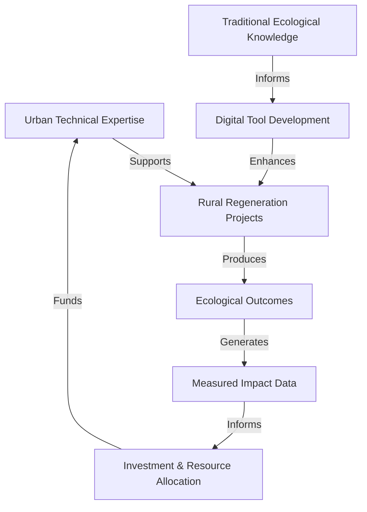

# Creating Roots in the Territory

## Introduction: The Mycorrhizal Network Model
> *Mycorrhizal networks are symbiotic relationships between fungi and plant roots that form interconnected underground systems. In these networks, fungi extend plant root systems, helping them absorb nutrients and water while facilitating communication and resource sharing between seemingly separate plants. Unlike mere "mycelial" networks (the physical fungal structures), mycorrhizal networks specifically describe the mutually beneficial relationship between different organisms—a perfect metaphor for territorial regenerative collaboration.*

ReFi Barcelona's approach to territorial engagement draws deep inspiration from nature's most successful collaborative systems: mycorrhizal networks. These underground fungal networks connect separate plants through intricate webs of mycelium, allowing nutrients, water, and information to flow between seemingly disconnected organisms. Similarly, our territorial strategy aims to create invisible but powerful connections between diverse initiatives across the Catalan bioregion.

## Hypothesis: The Territory as Living System

Our core hypothesis posits that **regenerative initiatives achieve optimal impact when embedded within living networks of mutual support that mirror natural ecosystem relationships**. This hypothesis leads us to test several propositions:

1. Isolated regenerative projects face greater risks of failure than networked initiatives
2. Resource flows between complementary projects create greater systemic resilience
3. Urban and rural initiatives can form symbiotic relationships that benefit both contexts
4. The strength of territorial networks correlates directly with regenerative outcomes

## Identifying Ecological Network Nodes

Our rootedness begins by recognizing existing initiatives as vital nodes in an emerging ecological network:

| Initiative | Focus Area | Ecological Function | Network Role |
|------------|------------|---------------------|--------------|
| Emprius | Commons Management | Creates shared stewardship models | Policy Innovation |
| Ecohub | Circular Economy | Closes material loops | Metabolic Processing |
| Arran de Terra | Agroecology | Builds soil health | Nutrient Generation |
| Mas la Sala | Regenerative Land | Water cycle restoration | Hydrological Node |
| Mas les Vinyes | Permaculture | Biodiversity enhancement | Species Intersection |
| Resilience.Earth | Community Resilience | Adaptive capacity building | Network Immunology |
| Can Masdeu | Urban-Rural Bridge | Eco-education | Knowledge Transmission |
| Akasha | Decentralized Knowledge | Information flows | Neural Network |
| Miceli.social | Community Currencies | Resource circulation | Energy Exchange |
| Holon | Systems Change | Pattern recognition | Network Intelligence |

By mapping these initiatives through an ecological lens, we recognize that each plays a unique role in the territorial ecosystem. Rather than creating competition or redundancy, our aim is to enhance functional connections between these diverse nodes.

## The Territorial Mycorrhizal Framework

Our approach to creating territorial roots follows a biomimetic framework:

### 1. Mycelial Exploration (Mapping & Understanding)

Just as fungal hyphae explore soil for compatible plant roots, we:
- Conduct bioregional mapping to identify regenerative initiatives
- Assess resource needs, surpluses, and complementarities
- Document unique knowledge and methodologies
- Map formal and informal networks of trust

This exploration phase has already revealed over 120 potential partner initiatives across Catalonia, with clusters of activity in Alt Penedès, Garrotxa, and Terres de l'Ebre regions.

### 2. Connection Formation (Relationship Building)

Once compatible initiatives are identified, we establish formal connections:
- Create protocooperation agreements outlining mutual benefits
- Develop shared data standards for ecological monitoring
- Establish communication channels appropriate to each context
- Design mutual support mechanisms

Our connection methodology emphasizes right relationship over transactional exchanges. A successful connection manifests as:
- Bidirectional knowledge flows
- Resource sharing without extraction
- Capacity enhancement for both parties
- Increased resilience for the wider network

### 3. Nutrient Exchange (Value Flow)

With connections established, we facilitate exchanges that build regenerative capacity:
- Technical expertise flows from urban to rural contexts
- Ecological knowledge moves from rural to urban spaces
- Financial resources are directed to high-impact opportunities
- Digital tools support physical regeneration projects

This exchange process relies on understanding each node's unique "metabolic" needs and contributions:

### 4. Network Resilience (Systemic Health)

As connections mature, the network develops emergent resilience properties:
- Information about threats (climate events, policy changes) spreads rapidly
- Resources can be quickly mobilized toward urgent needs
- Innovation diffuses through established channels
- New initiatives can plug into existing support structures

## The Cooperative Advantage in Territory Building

Our cooperative legal structure provides critical advantages for territorial rooting:

1. **Legitimacy**: As a recognized form within the Catalan social economy, cooperatives enjoy existing relationships with both institutional and grassroots actors
2. **Flexibility**: The multi-stakeholder cooperative model allows diverse territorial actors to formalize their relationship with ReFi BCN
3. **Asset Lock**: Cooperative principles ensure territorial resources remain dedicated to social benefit
4. **Governance Participation**: Rural stakeholders gain direct voice in decision-making
5. **Intercooperative Principle**: The sixth cooperative principle explicitly promotes collaboration between cooperatives

## Concrete Initiatives Underway

Several pilot projects demonstrate our territorial rooting approach:

### Catalonia Regenerative Map
A collaborative digital twin mapping regenerative initiatives, ecosystem assets, and resource flows across the bioregion. This open-source platform combines:
- Geospatial ecological data
- Project profiles with regenerative metrics
- Resource exchange opportunities
- Governance participation mechanisms

### Knowledge Commons Protocol
A methodology for documenting and sharing place-based regenerative practices that:
- Respects traditional knowledge while making it accessible
- Creates attribution and reciprocity mechanisms
- Supports knowledge evolution and adaptation
- Connects rural wisdom with urban innovation

### Territorial Working Groups
Thematic collaborations addressing specific bioregional challenges:
- Mediterranean Forest Regeneration Network
- Watershed Restoration Collaborative
- Agroecological Transition Support
- Bioregional Economic Circle

## Challenges and Tensions

We recognize several challenges in our territorial approach:

- **Distance Friction**: Physical separation limits certain types of collaboration
- **Digital Divides**: Uneven access to technology across the territory
- **Trust Building**: Requires significant time investment and cultural sensitivity
- **Expectation Management**: Urban and rural timescales often differ significantly
- **Resource Imbalances**: Urban nodes typically control more financial resources

## Metrics for Successful Rooting

We measure our territorial rootedness through several indicative metrics:

- **Connection Density**: Number and quality of formal relationships with territorial initiatives
- **Resource Flow Volume**: Quantitative measure of resources exchanged through the network
- **Knowledge Transfer**: Documentation and application of territorial regenerative practices
- **Collaborative Projects**: Number and impact of joint initiatives
- **Participation Diversity**: Geographic and sectoral diversity of network participants

## Strategic Intentions 2024-2026

Our medium-term intentions for territorial rooting include:

1. Establish formal relationships with at least 30 key regenerative initiatives across Catalonia
2. Develop a comprehensive bioregional map identifying priority intervention zones
3. Create a physical presence in at least three rural nodes beyond Barcelona
4. Facilitate at least €500,000 in resource flows to territorial regenerative projects
5. Document and share at least 50 place-based regenerative methodologies

## Conclusion: Becoming Indigenous to Place

True territorial rootedness requires something deeper than strategic networking—it requires becoming indigenous to place. While respecting that many of us are not native to this bioregion, we recognize our responsibility to develop deep relationships with the Catalan landscape and its traditional stewards.

This process of becoming indigenous to place means:
- Learning local ecological patterns and cycles
- Understanding the history and cultural context of the territory
- Acknowledging existing relationships between communities and landscapes
- Committing to long-term presence and care
- Accepting the reciprocal relationship between human and ecological communities

By creating mycorrhizal connections across the territory, we aim to support the emergence of a regenerative culture that is deeply rooted in place while connected to global innovation networks.

---

*This article forms part of ReFi Barcelona's bioregional framework. For related perspectives, see our articles on [Why a Bioregional Approach](why-bioregional-approach.md) and [Bridging the Urban-Rural Divide](bridging-urban-rural-divide.md).* 