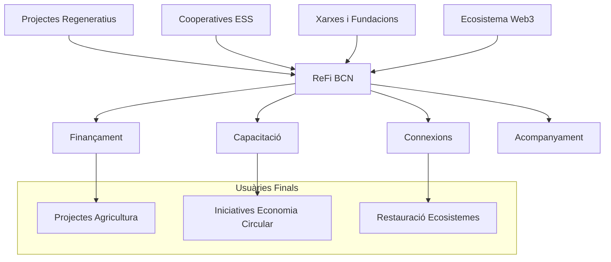
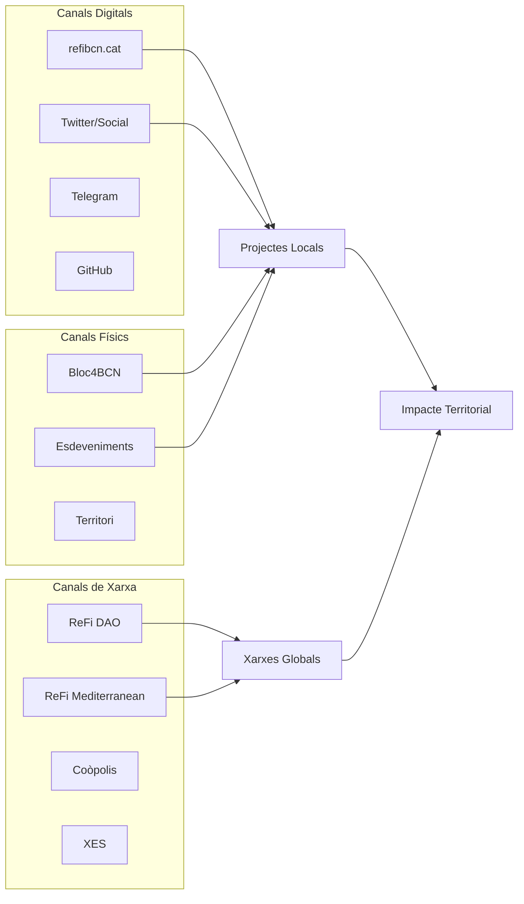
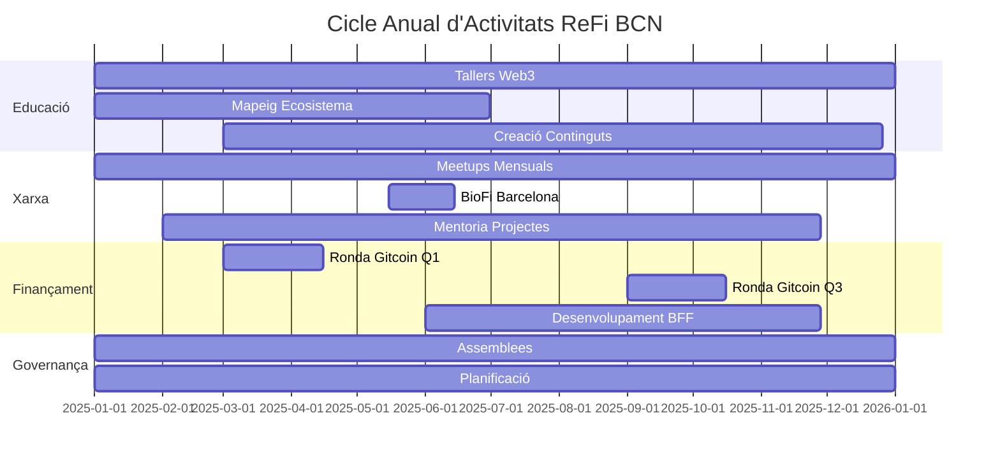
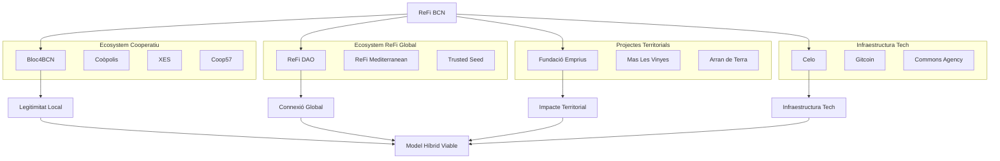
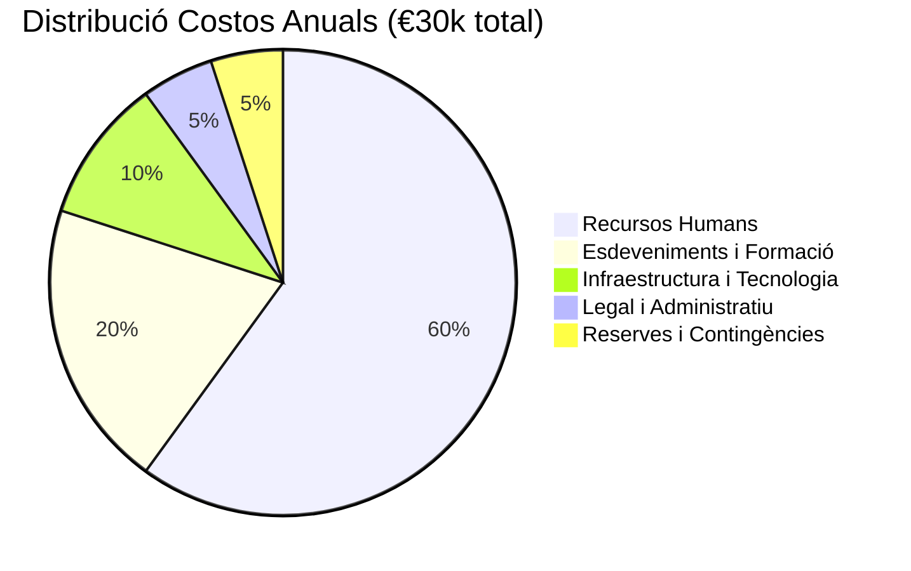
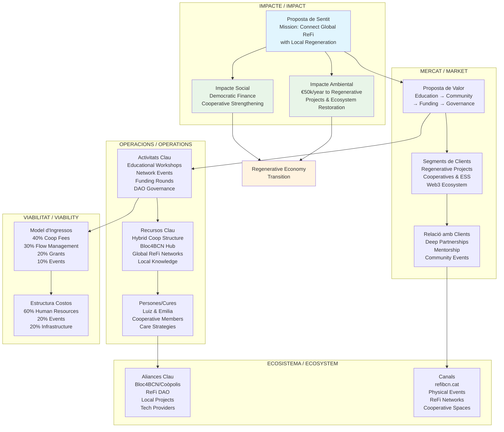

# Canvas Social - ReFi BCN

## Introducció / Introduction

Aquest document serveix com a plantilla per desenvolupar el Canvas Social de ReFi BCN, una eina per mapear i estructurar el nostre model de negoci social.

*This document serves as a template to develop ReFi BCN's Social Canvas, a tool to map and structure our social business model.*

---

## 1. Proposta de Sentit / Impacte
### Value/Impact Proposal

**Pregunta clau:** Quin és el nostre propòsit? Quin impacte volem generar?
**Key question:** What is our purpose? What impact do we want to generate?

**Missió Principal / Main Mission:**
- Connectar les finances regeneratives globals amb iniciatives locals de transició ecosocial a Catalunya
- Accelerar la regeneració territorial (persones i sistemes) mitjançant nous mecanismes de finançament i governança
- Contribuir a la regeneració bioregional de Catalunya millorant els processos de finançament regeneratiu

**Teoria del Canvi / Theory of Change:**
- Crear infraestructures híbrides que combinin Web3 amb models cooperatius per a la justícia econòmica
- Funcionar com a pont entre xarxes globals ReFi i regeneradors locals
- Desenvolupar una Bioregional Financing Facility (BFF) comunitària per dirigir recursos cap a la regeneració sistèmica

**Impacte Aspiracional / Aspirational Impact:**
- Transició cap a una economia regenerativa a Catalunya
- Fortaliment de la resiliència financera de les iniciatives locals de transició ecosocial
- Model replicable per a altres nodes ReFi bioregionals

---

## 2. Segments de Clients i Usuaris
### Customer and User Segments

**Pregunta clau:** Qui són els clients i usuaris? Quines són les seves necessitats? A qui ens dirigim?
**Key question:** Who are our clients and users? What are their needs? Who are we targeting?

**Segments Primaris / Primary Segments:**
- **A. Projectes Regeneratius Territorials**: Iniciatives d'agricultura regenerativa, restauració d'ecosistemes, economia circular
- **B. Cooperatives i ESS**: Cooperatives de treball, habitatge, consum; empreses socials establertes
- **C. Xarxes i Fundacions**: Organizacions que agreguen i donen suport a projectes locals
- **D. Ecosistema Web3/ReFi**: Protocols, DAOs i projectes blockchain amb focus regeneratiu

**Segments Secundaris / Secondary Segments:**
- **E. Institucions Públiques**: Ajuntaments, Generalitat, entitats supramunicipals
- **F. Finançament Ètic**: Bancs cooperatius, fundacions, inversors d'impacte

**Perfils Específics / Specific Profiles:**
- Fundació Emprius (economia circular)
- Mas Les Vinyes (agricultura regenerativa)
- Arran de Terra (agricultura regenerativa)
- Celo (infraestructura blockchain)
- Coop57 (finançament cooperatiu)

**Necessitats per Segment / Needs per Segment:**
- **A&B**: Accés a finançament, capacitació en Web3, acompanyament tècnic
- **C**: Eines per canalitzar recursos, connexions globals, amplificació d'impacte
- **D**: Connexió amb impacte territorial real, validació de projectes locals
- **E&F**: Models innovadors de finançament, transparència, mesura d'impacte



---

## 3. Proposta de Valor
### Value Proposition

**Pregunta clau:** Quina és la nostra oferta (productes, serveis o experiències)?
**Key question:** What is our offering (products, services or experiences)?

**Línies Estratègiques (Progressió):**

**1. Educació, Recerca i Informació** *(Del no-coneixement a la comprensió)*
- Tallers i seminaris sobre ReFi i Web3 adaptats al context ESS local
- Repositoris oberts d'informes, guies i mapes d'actors
- Toolkit locals per adaptar pràctiques globals al context català

**2. Comunitat i Xarxa** *(De la comprensió a la col·laboració)*
- Trobades regulars (meetups, jornades, retirs) connectant locals i globals
- Programes de mentoria i intercanvi amb cooperatives
- Sessions amb experts internacionals

**3. Recursos i Capacitat Financera** *(De la col·laboració a l'impacte tangible)*
- Assessorament en captació de fons (subvencions Web3, monedes socials, DAO)
- Orientació tècnica sobre governança distribuïda
- Acompanyament personalitzat per implementar eines financeres regeneratives

**4. Governança i Innovació** *(De la consolidació a la transformació sistèmica)*
- Pràctiques de governança democràtica, transparent i distribuïda
- Innovació social i tecnològica per reforçar l'autonomia col·lectiva

**Propostes de Valor Úniques / Unique Value Propositions:**
- **Pont Híbrid**: Únic node que combina estructura cooperativa legal amb eines Web3
- **Arrelament Territorial**: Coneixement profund de l'ecosistema cooperatiu català
- **Connexió Global-Local**: Accés directe a xarxes ReFi globals mantenint focus local
- **Model Bioregional**: Enfocament sistèmic que transcendeix límits municipals

---

## 4. Relació amb Clients
### Customer Relationships

**Pregunta clau:** Com ens relacionem amb els nostres clients?
**Key question:** How do we relate to our customers?

**Tipus de Relacions per Segment:**

**Relacions Profundes / Deep Relationships:**
- **Membres Cooperativa**: Gouvernança democràtica, participació en decisions, propietat compartida
- **Projectes Partner**: Acords formals, suport continuu, desenvolupament conjunt de propostes

**Relacions d'Acompanyament / Accompaniment Relationships:**
- **Mentoria Personalitzada**: Suport 1:1 per projectes en desenvolupament
- **Consultoria Tècnica**: Assessorament especialitzat en Web3, governança, finançament
- **Programes d'Incubació**: Procés estructurat per desenvolupar capacitats

**Relacions Comunitàries / Community Relationships:**
- **Esdeveniments Regulars**: Trobades mensuals, tallers trimestrals, retirs anuals
- **Espais d'Aprenentatge**: Sessions formatives, intercanvi d'experiències
- **Plataformes Digitals**: Telegram, fòrums, repositoris de coneixement

**Relacions de Xarxa / Network Relationships:**
- **Connexions Estratègiques**: Facilitació de trobades entre actors complementaris
- **Col·laboracions Internacionals**: Connexió amb altres nodes ReFi Mediterranean
- **Aliances Institucionals**: Relacions amb administracions públiques i fundacions

**Mecanismes de Cura / Care Mechanisms:**
- Seguiment personalitzat del benestar dels membres
- Espais de suport mutu i resolució de conflictes
- Reconeixement i celebració d'èxits col·lectius

---

## 5. Canals
### Channels

**Pregunta clau:** A través de quins canals ens relacionem? Com fem arribar la nostra proposta (distribució)?
**Key question:** Through which channels do we relate? How do we deliver our proposition (distribution)?

**Canals Digitals / Digital Channels:**
- **Web/Knowledge Base**: refibcn.cat (mapes d'ecosistemes, recursos)
- **Xarxes Socials**: Twitter @ReFiBCN, LinkedIn, Telegram
- **Plataformes Web3**: Gitcoin, Discord communities, DAO tools
- **Repositoris Oberts**: GitHub, documents col·laboratius

**Canals Físics / Physical Channels:**
- **Bloc4BCN**: Seu física a l'hub cooperatiu més gran d'Europa
- **Esdeveniments Propis**: ReFi Unconference, BioFi Barcelona
- **Espais Cooperatius**: Xarxa d'Ateneus Cooperatius, CoòpoliS
- **Territori**: Visites a projectes, treball de camp bioregional

**Canals de Xarxa / Network Channels:**
- **ReFi DAO**: Connexió amb xarxa global
- **ReFi Mediterranean**: Col·laboració bioregional
- **Coòpolis**: Incubadora cooperativa oficial
- **Xarxa d'Economia Solidària (XES)**: Ecosistema ESS català

**Canals d'Esdeveniments / Event Channels:**
- **Trobades Regulars**: Meetups mensuals, jornades trimestrals
- **Tallers Formatius**: Sessions especialitzades per temàtica
- **Conferències**: Participació en esdeveniments del sector
- **Retirs**: Experiències immersives de formació i connexió



---

## 6. Model d'Ingressos
### Revenue Model

**Pregunta clau:** Com generem ingressos? Com finançem el nostre projecte?
**Key question:** How do we generate income? How do we finance our project?

**Fonts d'Ingressos Actuals / Current Revenue Streams:**
- **Quotes Cooperativa**: Contribucions mensuals dels membres (€20-50/mes segons capacitat)
- **Serveis de Consultoria**: Assessorament a cooperatives en Web3 i finançament (€500-2000/projecte)
- **Organització d'Esdeveniments**: Ingressos per entrades, patrocinadors, col·laboracions

**Fonts d'Ingressos en desenvolupament / Developing Revenue Streams:**
- **Comissions Gitcoin Rounds**: 2-5% de fons gestionats en rondes de finançament quadràtic
- **Programes d'Incubació**: Cursos i acompanyament estructurat (€200-500/participant)
- **Serveis BFF**: Gestió de fluxos financers per tercers (1-3% comissió)

**Estratègies de Finançament / Funding Strategies:**

**Finançament Cooperatiu:**
- Coop57: Crèdit per establiment inicial (€10-20k)
- Fundació Seira: Subvencions per programes educatius (€5-15k)
- Fiare Banca Etica: Finançament ètic per inversions

**Finançament Web3:**
- Gitcoin Grants: Finançament quadràtic recurrent
- Celo Community Fund: Grants per desenvolupament d'ecosistema
- ReFi DAO: Subvencions per activitats de node local

**Finançament Públic:**
- Generalitat Catalunya: Subvencions economia social i transició ecològica
- Ajuntament Barcelona: Programes d'innovació social
- Fons Europeus: Programes LIFE, Horizon Europe

**Model Híbrid Objectiu:**
- 40% Quotes i serveis cooperativa
- 30% Comissions gestió de fluxos
- 20% Subvencions i grants
- 10% Esdeveniments i formacions

---

## 7. Impacte Social
### Social Impact

**Pregunta clau:** Quines són les implicacions socials de la nostra activitat?
**Key question:** What are the social implications of our activity?

**Impactes Socials Directes / Direct Social Impacts:**
- **Democratització Financera**: Accés més equitatiu a finançament per projectes regeneratius
- **Capacitació Digital**: Alfabetització Web3 per cooperatives i ESS tradicional
- **Enfortiment Cooperatiu**: Revitalització del moviment cooperatiu amb noves eines
- **Connexió Urban-Rural**: Pont entre innovació urbana i regeneració territorial

**Impactes Socials Sistèmics / Systemic Social Impacts:**
- **Economia Regenerativa**: Transició cap a models econòmics que regeneren sistemes socials
- **Governança Distribuïda**: Promoció de models democràtics més participatius
- **Sobirania Financera**: Reducció de dependència de sistemes financers extractius
- **Resiliència Comunitària**: Fortaliment de xarxes locals de suport mutu

**Indicadors de Mesura / Measurement Indicators:**

**Quantitatius:**
- Nombre de projectes finançats (objectiu: 20/any)
- Import total mobilitzat (objectiu: €100k/any)
- Participants en formacions (objectiu: 200/any)
- Membres cooperativa actius (objectiu: 50)

**Qualitatius:**
- Grau de satisfacció participants (enquestes post-esdeveniment)
- Testimonis d'impacte de projectes finançats
- Evolució capacitats digitals cooperatives acompanyades
- Qualitat connexions generades entre actors

**Impactes Indirectes:**
- Replicació model en altres territoris
- Influència en polítiques públiques
- Inspiració per altres nodes ReFi
- Contribució a narrativa de transició ecosocial

---

## 8. Activitats Clau
### Key Activities

**Pregunta clau:** Quines activitats necessitem per generar la nostra proposta de valor per als clients?
**Key question:** What activities do we need to generate our value proposition for clients?

**Activitats Educatives / Educational Activities:**
- **Tallers Web3 per ESS**: Sessions mensuals sobre blockchain, DeFi, DAOs
- **Seminaris ReFi**: Formació en finances regeneratives i mecanismes innovadors
- **Creació de Continguts**: Guies, casos d'estudi, traduccions al català
- **Mapeig d'Ecosistemes**: Investigació i documentació d'actors locals

**Activitats de Xarxa / Network Activities:**
- **Esdeveniments Regulars**: ReFi Meetups, BioFi Barcelona, Unconference
- **Programes de Mentoria**: Acompanyament 1:1 a projectes
- **Connexions Estratègiques**: Facilitació de trobades entre actors
- **Col·laboracions Internacionals**: Participació en ReFi Mediterranean

**Activitats de Finançament / Funding Activities:**
- **Rondes Gitcoin**: Organització de finançament quadràtic local
- **Assessorament Grant**: Suport en aplicacions a subvencions Web3
- **Desenvolupament BFF**: Creació d'infraestructura financera bioregional
- **Gestió de Fluxos**: Intermediació entre finançadors i projectes

**Activitats de Governança / Governance Activities:**
- **Assemblees Cooperativa**: Decisions democràtiques mensuals
- **Facilitació DAO**: Implementació d'eines governance distribuïda
- **Resolució Conflictes**: Mediació i suport en dinàmiques grupals
- **Planificació Estratègica**: Sessions trimestrals de revisió i adaptació



---

## 9. Recursos Clau
### Key Resources

**Pregunta clau:** Amb quins recursos i capacitats comptem per generar la nostra proposta?
**Key question:** What resources and capacities do we have to generate our proposition?

**Recursos Humans / Human Resources:**
- **Equip Nucli**: Luiz Fernando (Coordinator), Emilia Sierra (Community Lead)
- **Membres Cooperativa**: Experts en cooperativisme, Web3, desenvolupament territorial
- **Xarxa de Mentors**: Professionals ReFi DAO, Trusted Seed, cooperatives establertes
- **Col·laboradors Ocasionals**: Facilitadors, consultors especialitzats

**Recursos Institucionals / Institutional Resources:**
- **Estructura Legal**: Cooperativa SCCL (en constitució via Coòpolis)
- **Seu Física**: Espai a Bloc4BCN (40+ cooperatives, infraestructura compartida)
- **Reconeixement**: Incubació oficial per Coòpolis Barcelona
- **Xarxes**: Integració en XES, ReFi DAO, ReFi Mediterranean

**Recursos Tecnològics / Technological Resources:**
- **Infraestructura Digital**: Web refibcn.cat, repositoris GitHub, plataformes col·laboratives
- **Eines Web3**: Wallets multi-sig, plataformes DAO, protocols DeFi
- **Plataformes Educatives**: Materials formatius, documentació tècnica
- **Sistemes de Comunicació**: Telegram, Discord, mailing lists

**Recursos Financers / Financial Resources:**
- **Capital Inicial**: Aportacions fundadors (€2-5k)
- **Línies de Crèdit**: Accés a Coop57, Fiare (fins €20k)
- **Grants Actius**: Finançament ReFi DAO, aplicacions Gitcoin
- **Fluxos Recurrents**: Quotes membres, primers ingressos serveis

**Recursos de Coneixement / Knowledge Resources:**
- **Knowledge Base**: Mapes d'ecosistemes, guies pràctiques, casos d'estudi
- **Experiència Acumulada**: 2+ anys organitzant comunitat ReFi Barcelona
- **Connexions Globals**: Accés directe a xarxes i experts internacionals
- **Context Local**: Coneixement profund ESS catalana, relacions establertes

**Altres Recursos Estratègics / Other Strategic Resources:**
- **Reputació**: Reconeixement com a node pioner híbrid cooperativa-Web3
- **Momentum**: Creixement orgànic comunitat i demanda serveis
- **Localització**: Barcelona com a hub innovació i cooperativisme
- **Timing**: Convergència entre maduresa ReFi i necessitats ESS local

---

## 10. Persones / Cures
### People / Care

**Pregunta clau:** Amb quines persones comptem? Quines capacitats tenen? Quines necessiten? Com les cuidem?
**Key question:** What people do we count on? What capacities do they have? What do they need? How do we care for them?

**Equip Actual / Current Team:**

**Luiz Fernando Gomez Segala** - Fundador & Coordinador
- *Capacitats*: Core Steward ReFi DAO, experiència Web3, construcció comunitats
- *Dedicació*: 60% temps, coordinació general, relacions externes
- *Necessitats*: Suport administratiu, delegació operativa, equilibri vida-treball

**Emilia Sierra Guzmán** - Community Lead
- *Capacitats*: Branding, estratègia d'impacte, educació, connexió amb terra
- *Dedicació*: 40% temps, desenvolupament comunitat, comunicació
- *Necessitats*: Formació tècnica Web3, suport creativitat, espais reflexió

**Membres Cooperativa Fundadors** (5-8 persones)
- *Capacitats Diverses*: Cooperativisme, desenvolupament territorial, tecnologia, ESS
- *Dedicació*: Variable (10-30% temps segons disponibilitat)
- *Necessitats*: Formació governança DAO, clarificació rols, compensació gradual

**Xarxa de Col·laboradors** (15-20 persones)
- *Capacitats*: Facilitació, consultoria especialitzada, connexions sectorials
- *Dedicació*: Projectes específics, col·laboracions puntuals
- *Necessitats*: Oportunitats col·laboració, reconeixement, desenvolupament professional

**Necessitats Generals de l'Equip / General Team Needs:**
- **Formació Contínua**: Actualització Web3, governança cooperativa, facilitació
- **Sostenibilitat Econòmica**: Transició gradual cap a dedicació remunerada
- **Desenvolupament Personal**: Oportunitats creixement, participació decisions
- **Equilibri**: Gestió càrrega treball, prevenció burn-out, suport mutu

**Estratègies de Cura / Care Strategies:**

**Cura Individual:**
- Check-ins regulars 1:1 per avaluar benestar i necessitats
- Flexibilitat horaris i modes de treball (presencial/remot)
- Suport per formació i desenvolupament professional
- Reconeixement públic contribucions i èxits

**Cura Col·lectiva:**
- Assemblees mensuals amb espai per compartir i escoltar
- Retirs trimestrals per connexió i planificació estratègica
- Celebracions d'èxits i fites assolides
- Protocols resolució conflictes i mediació

**Cura Sistèmica:**
- Distribució progressiva de responsabilitats i poder decisori
- Creació de rols diversos que permetin diferents tipus de participació
- Desenvolupament de lideratge compartit i mentoració interna
- Integració principis de justícia restaurativa en governança

**Plans de Creixement / Growth Plans:**
- Incorporació gradual nous membres segons creixement activitat
- Diversificació perfils: tècnic/a desenvolupament, coordinador/a territorial
- Creació de rols especialitzats: educació, finançament, investigació
- Desenvolupament de capacitats de lideratge en membres actuals

---

## 11. Aliances Clau
### Key Partnerships

**Pregunta clau:** Qui són els nostres aliats principals? Proveïdors? Col·laboradors? Institucions?
**Key question:** Who are our main allies? Suppliers? Collaborators? Institutions?

**Socis Estratègics Fonamentals / Fundamental Strategic Partners:**

**Bloc4BCN & Coòpolis**
- *Relació*: Incubadora oficial, seu física, mentoria legal i econòmica
- *Valor Aportat*: Legitimitat, infraestructura, accés ecosistema cooperatiu català
- *Compromisos Mutus*: Espai de treball, formació, model de referència híbrid

**ReFi DAO**
- *Relació*: Luiz com a Core Steward, node local oficial
- *Valor Aportat*: Connexió global, finançament, expertise tècnic, reputació
- *Compromisos Mutus*: Representació local, feedback territoriol, contribució govern global

**ReFi Mediterranean**
- *Relació*: Co-fundador, coordinació bioregional
- *Valor Aportat*: Escala bioregional, aprenentatge inter-nodal, rondes conjuntes
- *Compromisos Mutus*: Lideratge iniciatives, compartir recursos, visió comuna

**Col·laboradors Territorials / Territorial Collaborators:**

**Fundació Emprius**
- *Relació*: Projecte partner, cas d'estudi, beneficiari serveis
- *Valor Aportat*: Expertise economia circular, connexió territori, validació model
- *Compromisos Mutus*: Col·laboració programes, documentació experiència

**Mas Les Vinyes**
- *Relació*: Projecte regeneratiu partner, connexió rural-urbana
- *Valor Aportat*: Pràctica regenerativa real, aprenentatge bioregional
- *Compromisos Mutus*: Suport finançament, visibilitat, intercanvi coneixement

**Arran de Terra**
- *Relació*: Xarxa agricultura regenerativa, membre potencial cooperativa
- *Valor Aportat*: Experiència territorial, connexions rurals, legitimitat sector
- *Compromisos Mutus*: Desenvolupament conjunt propostes, suport mutu

**Institucions de Suport / Supporting Institutions:**

**Xarxa d'Economia Solidària (XES)**
- *Relació*: Membre, integració ecosistema ESS català
- *Valor Aportat*: Legitimitat sector, connexions, recursos formatius
- *Compromisos Mutus*: Participació activa, contribució innovació, formació membres

**Coop57**
- *Relació*: Entitat financera cooperativa, client potencial i proveïdor
- *Valor Aportat*: Finançament ètic, infraestructura financera, confiança sector
- *Compromisos Mutus*: Desenvolupament productes híbrids, pilot innovacions

**Commons Agency**
- *Relació*: Co-organitzador BioFi Barcelona, alineació metodològica
- *Valor Aportat*: Expertise facilitació, metodologies participatives, reputació
- *Compromisos Mutus*: Co-creació esdeveniments, desenvolupament metodologies

**Proveïdors Tecnològics / Technology Providers:**

**Celo Ecosystem**
- *Relació*: Infraestructura blockchain, grants, suport tècnic
- *Valor Aportat*: Tecnologia accessible, finançament desenvolupament, comunitat
- *Compromisos Mutus*: Feedback tècnic, casos d'ús locals, advocacia

**Gitcoin**
- *Relació*: Plataforma rondes finançament, proveïdor serveis
- *Valor Aportat*: Infraestructura quadratic funding, expertise, visibilitat global
- *Compromisos Mutus*: Organització rondes locals, feedback millores, promoció



---

## 12. Impacte Mediambiental
### Environmental Impact

**Pregunta clau:** Quins efectes ambientals tindrà la nostra activitat? Com ho gestionarem?
**Key question:** What environmental effects will our activity have? How will we manage them?

**Impactes Positius Directes / Direct Positive Impacts:**

**Finançament Regeneratiu:**
- Canalització de capital cap a projectes d'agricultura regenerativa (objectiu: €50k/any)
- Suport a iniciatives de restauració d'ecosistemes i biodiversitat
- Promoció d'economia circular i reducció de residus

**Transformació de Sistemes Financers:**
- Desenvolupament d'infraestructures financeres que prioritzen regeneració sobre extracció
- Democratització accés a finançament per projectes ambientals petits i mitjans
- Innovació en mecanismes que alineen incentius econòmics amb salut ecosistèmica

**Educació i Conscienciació:**
- Formació sobre connexions entre sistemes financers i crisi ecològica
- Promoció de narratives que integren economia i ecologia
- Capacitació per implementar pràctiques regeneratives

**Impactes Positius Sistèmics / Systemic Positive Impacts:**

**Bioregional:**
- Contribució a la regeneració integral de la bioregió catalana
- Fortaliment connexions urban-rural per a fluxos circulars de recursos
- Suport a la sobirania alimentària i energètica local

**Escalabilitat:**
- Model replicable per altres bioregions mediterrànies
- Influència en polítiques públiques cap a finançament regeneratiu
- Inspiració per altres nodes ReFi globals

**Impactes a Mitigar / Impacts to Mitigate:**

**Footprint Digital:**
- Ús d'energia per infraestructura Web3 (blockchain, servidors)
- Emissions per desplaçaments a esdeveniments i reunions
- Consum de recursos per producció materials educatius

**Efectes Indirectes:**
- Risc de gentrificació per visibilització de projectes rurals
- Possible sobre-financiació d'alguns projectes vs. desatenció d'altres
- Dependència excessiva de tecnologies amb impacte ambiental

**Estratègies de Sostenibilitat / Sustainability Strategies:**

**Compensació i Reducció:**
- Prioritat blockchain eco-eficients (Celo vs. Ethereum)
- Offset emissions mitjançant finançament directe projectes de seqüestre carboni
- Promoció transport públic i compartit per esdeveniments

**Principis Regeneratius:**
- Aplicació de principis BioFi: inversions que regeneren més del que extreuen
- Mesura i seguiment impacte ecològic de tots els projectes finançats
- Integració criteris ambientals en processos de decision de finançament

**Innovació Circular:**
- Desenvolupament de monedes locals vinculades a serveis ecosistèmics
- Experimentació amb NFTs i tokens que representin actius naturals reals
- Promoció de models econòmics basats en abundància natural vs escassetat artificial

**Indicadors Ambientals:**
- Tonnes CO2 eq. evitades per projectes finançats
- Hectàrees en procés de regeneració
- Nombre de projectes d'energia renovable suportats
- Reducció footprint digital de l'organització (any sobre any)

---

## 13. Estructura de Costos
### Cost Structure

**Pregunta clau:** Quins costos principals tindrem? Què està associat a la nostra activitat?
**Key question:** What main costs will we have? What is associated with our activity?

**Costos Fixos Mensuals / Monthly Fixed Costs:**

**Operacionals Bàsics (€800-1200/mes):**
- Espai de treball Bloc4BCN: €200-300/mes
- Infraestructura digital (web, servers, eines): €100-150/mes
- Assegurances i obligacions legals cooperativa: €50-100/mes
- Comunicacions i subscripcions essencials: €50-100/mes
- Material oficina i subministraments: €50-100/mes

**Recursos Humans (€2000-4000/mes progressiu):**
- Compensació parcial coordinació (Luiz): €800-1200/mes
- Compensació parcial community lead (Emilia): €600-1000/mes
- Compensacions membres actius cooperativa: €200-500/mes
- Assessoria legal i comptable: €200-400/mes

**Costos Variables per Activitat / Variable Costs per Activity:**

**Esdeveniments (€1000-3000/esdeveniment):**
- Lloguer espais (quan necessari): €200-500
- Catering i materials: €300-800
- Compensació facilitadors externs: €200-600
- Materials i merchandising: €100-300
- Comunicació i promoció: €100-400

**Formacions i Tallers (€200-500/sessió):**
- Compensació formadors especialitzats: €100-300
- Materials educatius i recursos: €50-100
- Plataformes i eines formatives: €30-50
- Seguiment i avaluació: €20-50

**Desenvolupament de Projectes (€500-2000/projecte):**
- Recerca i desenvolupament: €200-600
- Consultoria externa especialitzada: €200-800
- Viatges i desplaçaments: €100-400
- Documentació i disseminació: €100-300

**Inversions Necessàries / Required Investments:**

**Primer Any (€5000-8000):**
- Constitució legal cooperativa: €1000-1500
- Desenvolupament infraestructura digital: €1500-2500
- Formació equip (Web3, cooperativisme, facilitació): €1000-2000
- Marketing i branding inicial: €800-1200
- Reserva d'emergència: €1000-2000

**Creixement (Any 2-3, €10000-15000):**
- Ampliació equip (contractació parcial): €6000-10000
- Tecnologia avançada (plataformes DAO, eines): €2000-3000
- Expansió territorial (viatges, esdeveniments): €1500-2500
- Infraestructura física millorada: €500-1000

**Model de Costos per Línia Estratègica:**



**Estratègies d'Optimització:**
- Aprofitament màxim infraestructura compartida Bloc4BCN
- Intercanvi de serveis amb altres cooperatives (trueque)
- Voluntariat per tasques no crítiques
- Economies d'escala en esdeveniments conjunts
- Digitalització processos per reduir costos administratius

**Escalabilitat de Costos:**
- Fase inicial: Costos mínims viables (€15-20k/any)
- Fase consolidació: Creixement controlat (€30-40k/any)
- Fase expansió: Sostenibilitat plena equip (€50-80k/any)

---

## Canvas Social Integrat / Integrated Social Canvas

### Visió Global del Model / Global Model Overview



### Síntesi del Model / Model Synthesis

**ReFi BCN funciona com un organisme híbrid** que combina la legitimitat i arrelament territorial d'una cooperativa catalana amb la innovació i connexió global de les xarxes Web3/ReFi. Aquest model genera valor a través de quatre fluxos interconnectats:

1. **Flux de Coneixement**: Traducció bidireccional entre innovació global i necessitats locals
2. **Flux de Xarxa**: Connexions estratègiques que amplien l'impacte de tots els participants
3. **Flux Financer**: Canalització democràtica de recursos cap a regeneració territorial
4. **Flux de Governança**: Desenvolupament de models participatius que combinen cooperativisme i Web3

**El model és viable perquè:**
- Respon a necessitats reals i creixents del mercat (finançament regeneratiu accessible)
- Combina múltiples fonts d'ingressos (cooperatives, Web3, públiques)
- Té baixos costos operatius gràcies a la infraestructura compartida
- Genera valor per a tots els stakeholders de l'ecosistema

---

## Connexions i Dependències / Connections and Dependencies

### Mapa de Relacions / Relationship Map

**Com es connecten els diferents components del canvas / How the different canvas components connect:**

#### **Flux Central / Central Flow**
```
Proposta de Sentit/Impacte (1) → Proposta de Valor (3) → Segments de Clients (2)
                ↓                           ↓                      ↓
        Activitats Clau (8) ← → Recursos Clau (9) ← → Relació amb Clients (4)
                ↓                           ↓                      ↓
        Aliances Clau (11) ← → Persones/Cures (10) ← → Canals (5)
                ↓                           ↓                      ↓
    Impacte Mediambiental (12) ← → Estructura de Costos (13) ← → Model d'Ingressos (6)
                                            ↓
                                   Impacte Social (7)
```

#### **Relacions Clau / Key Relationships**

**1→3→2: Missió to Market**
- La **Proposta de Sentit** defineix la **Proposta de Valor** que serveix als **Segments de Clients**
- *The Purpose/Impact Proposal defines the Value Proposition that serves the Customer Segments*

**8↔9: Operacions Core / Core Operations**
- Les **Activitats Clau** requereixen **Recursos Clau** específics i viceversa
- *Key Activities require specific Key Resources and vice versa*

**4↔5: Experiència Client / Customer Experience**
- La **Relació amb Clients** es materialitza a través dels **Canals**
- *Customer Relationships are materialized through Channels*

**6↔13: Viabilitat Financera / Financial Viability**
- El **Model d'Ingressos** ha de cobrir l'**Estructura de Costos**
- *The Revenue Model must cover the Cost Structure*

**10↔11: Ecosistema Humà / Human Ecosystem**
- Les **Persones/Cures** internes es complementen amb les **Aliances** externes
- *Internal People/Care complements external Key Partnerships*

**1→7→12: Impacte Integral / Integral Impact**
- La **Proposta de Sentit** es manifesta en **Impacte Social** i **Impacte Mediambiental**
- *The Purpose/Impact Proposal manifests in Social Impact and Environmental Impact*

### Dependències Crítiques / Critical Dependencies

**Alta Interdependència / High Interdependency:**
- [ ] **2↔3↔4**: Clients, Valor i Relacions han d'estar perfectament alineats
- [ ] **8↔9↔13**: Activitats, Recursos i Costos determinen la viabilitat operativa
- [ ] **1↔7↔12**: Tots els impactes han de ser coherents amb la missió

**Dependències Seqüencials / Sequential Dependencies:**
- [ ] **1→3**: Primer definir propòsit, després valor
- [ ] **3→2**: La proposta de valor defineix els segments objectiu
- [ ] **8→9**: Les activitats determinen els recursos necessaris
- [ ] **9→13**: Els recursos determinen l'estructura de costos

**Dependències de Feedback / Feedback Dependencies:**
- [ ] **2→6**: Els clients influencien el model d'ingressos
- [ ] **6→13→9**: Els ingressos limiten els recursos disponibles
- [ ] **4→5→2**: L'experiència del client influencia la segmentació

### Punts de Tensió / Tension Points

**Equilibris a Gestionar / Balances to Manage:**

1. **Impacte vs. Sostenibilitat Financera**
   - Tensió entre: Proposta de Sentit (1) ↔ Model d'Ingressos (6)
   - *Tension between: Purpose/Impact Proposal ↔ Revenue Model*

2. **Qualitat vs. Escala**
   - Tensió entre: Relació amb Clients (4) ↔ Estructura de Costos (13)
   - *Tension between: Customer Relationships ↔ Cost Structure*

3. **Innovació vs. Recursos**
   - Tensió entre: Activitats Clau (8) ↔ Recursos Clau (9)
   - *Tension between: Key Activities ↔ Key Resources*

4. **Autonomia vs. Col·laboració**
   - Tensió entre: Persones/Cures (10) ↔ Aliances Clau (11)
   - *Tension between: People/Care ↔ Key Partnerships*

### Sessions de Validació de Connexions / Connection Validation Sessions

**Preguntes per a cada connexió / Questions for each connection:**

- **Coherència**: Aquests elements es reforcen mútuament?
- **Dependència**: Què passa si un d'aquests elements canvia?
- **Priorització**: Quin element és més crític per a l'altre?
- **Optimització**: Com podem millorar aquesta connexió?

*- **Coherence**: Do these elements mutually reinforce each other?*
*- **Dependency**: What happens if one of these elements changes?*
*- **Prioritization**: Which element is more critical for the other?*
*- **Optimization**: How can we improve this connection?*

---

## Properes Passes / Next Steps

**Accions Immediates / Immediate Actions:**
1. [✅] Canvas complet amb informació atòmica i interconnectada
2. [ ] **Revisió Equip**: Validació del model amb membres fundadors cooperativa
3. [ ] **Validació Stakeholders**: Feedback de Bloc4BCN, ReFi DAO, projectes partners
4. [ ] **Refinament Financiero**: Ajust model ingressos/costos segons feedback
5. [ ] **Roadmap Implementació**: Cronograma detallat per 2025-2026

**Properes Fases / Next Phases:**
1. **Fase Validació** (Gener-Febrer 2025): Testing del model amb stakeholders clau
2. **Fase Pilot** (Març-Maig 2025): Implementació gradual amb BioFi Barcelona event
3. **Fase Escalació** (Juny+ 2025): Expansió completa del model validat

**Sessions de Treball Planificades / Planned Work Sessions:**
- **Validació Interna**: 15 Gener 2025 - Equip nucli + membres fundadors
- **Feedback Stakeholders**: 30 Gener 2025 - Partners estratègics
- **Revisió Model**: 15 Febrer 2025 - Incorporació feedback i ajustos finals

**Mètriques de Validació / Validation Metrics:**
- Nivell d'acceptació stakeholders (objectiu: >80% satisfacció)
- Viabilitat financera confirmada (break-even <12 mesos)
- Alineació amb valors cooperatius i ReFi (100% compliance)

---

**Última actualització / Last update:** Gener 2025 - Canvas Social completat
**Participants en la sessió / Session participants:** Desenvolupat amb inputs de documents oficials ReFi BCN
**Status:** ✅ Complet - Preparat per validació i implementació
